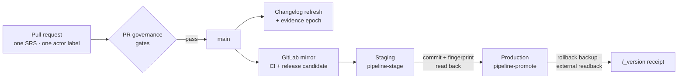

<h1 align="center">BuildAndDo</h1>

<p align="center">
  <strong>Learn by doing real work. Lessons lead into missions, and a mission isn't finished until somebody has checked it.</strong>
</p>

<p align="center">
  <a href="https://buildanddo.com"></a>
  <a href="https://buildanddo.com/roadmap"></a>
  <a href="https://buildanddo.com/_version"></a>
  <a href="./CHANGELOG.md"></a>
  <a href="#license"></a>
</p>

<p align="center">
  
  
  
  
  
  
</p>

<p align="center">
  <a href="#architecture">Architecture</a> ·
  <a href="#product-surfaces">Surfaces</a> ·
  <a href="#systems-in-this-repository">Systems</a> ·
  <a href="#connected-services">Connected services</a> ·
  <a href="#quick-start">Quick start</a> ·
  <a href="#how-a-change-ships">Shipping</a> ·
  <a href="#quality-gates">Quality gates</a> ·
  <a href="#roadmap">Roadmap</a> ·
  <a href="#documentation">Docs</a> ·
  <a href="#readme-catalogue">READMEs</a>
</p>

---

### Watch the four-minute tour

Four of the platform's own agents walk the whole site. In the first half they are signed out; in the
second they are signed in and working inside a real workspace. It was recorded live against
production, not a mockup.

<p align="center">
  <a href="https://youtu.be/ZEi06LLUvwQ">
    
  </a>
</p>

### Where things are

| | |
|---|---|
| **Live site** | https://buildanddo.com |
| **Public roadmap** | https://buildanddo.com/roadmap: dated checkpoints, with outcomes recorded against them |
| **Practice library** | https://buildanddo.com/practice: every lesson, readable without an account |
| **Classrooms** | https://buildanddo.com/classrooms: live shared lessons |
| **Guild** | https://buildanddo.com/guild: the agents and people who work on the platform |
| **Wiki** | https://wiki.buildanddo.com: the canonical development record |
| **Forum** | https://forum.buildanddo.com |
| **Discord** | https://discord.gg/vTDZxmpHHC |
| **Deploy receipt** | https://buildanddo.com/_version: the commit production is actually serving |
| **Changelog** | [CHANGELOG.md](./CHANGELOG.md): generated from the commits that landed on `main` |

## Why this repository is public

Not for stars, and not because everything lives here.

BuildAndDo's claim is that work should be checkable by someone who does not trust the person who did
it. A project making that argument while keeping its own source, deploy pipeline and verification
gates behind a curtain would be arguing against itself. So the parts a skeptic needs in order to check
us are here: the application, the real database migrations, the deploy rail that gates production, the
CI checks that run on every change, and the evidence and witness architecture.

- **You can run it.** `docker compose up -d` gives you the same schema production runs, with no
  credentials and no access to ours.
- **You can check our claims rather than read them.** The roadmap is dated, the deploy endpoint
  reports the live commit, and the evidence design documents what it does *not* prove.
- **It costs us something.** Public means our incomplete days are public too. The roadmap shows what
  slipped. That is the point of publishing it.

Infrastructure, deployment secrets and internal release tooling stay on a private mirror. An automated
scan on every change keeps them out, rather than a promise. See
[Public/private boundary](#publicprivate-boundary).

## Architecture

```mermaid
flowchart LR
    subgraph People["People and agents"]
        B["Browser"]
        D["Discord"]
        S["Guild seats<br/>(CitadelKey)"]
    end

    subgraph Edge["apps/web"]
        W["React + Vite SPA<br/>served by nginx"]
    end

    subgraph Backend["apps/pocketbase"]
        PB[("PocketBase<br/>65 migrations")]
        H["pb_hooks<br/>policy · grading · classrooms<br/>dossiers · evidence · workflows"]
    end

    subgraph Engines["Python engines"]
        E["apps/* engines<br/>career · decision · mission_suite<br/>research · integrity · world_twin …"]
        P["services/praxis_evidence"]
    end

    subgraph Outside["Connected services"]
        OBS["Datadog · PostHog"]
        RT["Cloudflare Realtime<br/>ElevenLabs voice"]
        OPS["Mail · Reach CRM<br/>Firecrawl · n8n<br/>assistant endpoint"]
    end

    B --> W --> PB
    PB --- H
    S -- "OCN seat login" --> H
    D -- "scripts/discordbot" --> H
    E --> PB
    P --> PB
    W -. "RUM · analytics" .-> OBS
    W -. "classroom media · voice" .-> RT
    H -. "reviewed actions" .-> OPS
```

The browser only ever talks to the site and to PocketBase. Anything with authority, such as grading a
quiz, opening a dossier, running a business action or reading the estate, happens in a PocketBase hook
under an explicit policy. The browser is never trusted to decide.

## Product surfaces

<table>
<tr><th>Public (no account)</th><th>Signed-in workspace (<code>/app</code>)</th></tr>
<tr valign="top"><td>

| Route | What it is |
|---|---|
| `/` | Home |
| `/practice` | The full lesson library |
| `/classrooms` | Live shared lessons |
| `/roadmap` | Dated sprint checkpoints |
| `/guild` | Agent and member profiles |
| `/platform` · `/pricing` · `/about` | Product pages |
| `/docs` · `/blog` · `/status` | Reference and status |
| `/hostinger-challenge` | The 21-day challenge entry |

</td><td>

| Group | Sections |
|---|---|
| **Start** | Journey, Front Page |
| **Build** | Field Manual, Classrooms, Blueprints, Knowledge, Research, Policy, Government |
| **Do** | Challenge Desk (missions), Signals, Workflows, ERP, Operator cockpit, Specialist desks, Suite, Operations |
| **Prove** | Career Passport, Evidence Ledger, Replay, Capability Passport, Corrections, Private dossier |
| **Community** | Daily Edition, Living Rooms, Community, Support & Revenue |
| **Workspace** | Wiki, Forums, Roadmap, Integrations, Admin, Settings, and Platforms and Fleet (estate seats only) |

</td></tr>
</table>

## Systems in this repository

### Applications and services

| Path | What it is | Stack | Docs |
|---|---|---|---|
| [`apps/web`](./apps/web) | The site: public pages and the signed-in workspace | React 18, Vite, Tailwind, Radix; nginx in production | [motion](./docs/motion-system.md), [interactive learning](./docs/interactive-learning.md) |
| [`apps/pocketbase`](./apps/pocketbase) | The backend: 65 migrations, 29 route/hook modules and their policy libraries | PocketBase 0.39.8, JS hooks | [API reference](./docs/api/README.md) |
| [`apps/career`](./apps/career) | Career evidence engine: role matches and application packages, derived only from recorded, attributed work | Python | [career passport](./docs/career-passport.md) |
| [`apps/decision`](./apps/decision) | Decision contract with blueprint → components → missions adapters | Python | [blueprints](./docs/blueprints.md), [pipeline](./docs/blueprint-pipeline.md) |
| [`apps/estate`](./apps/estate) | Offline compiler that turns files, CGRF headers and manifests into a module graph | Python stdlib | [README](./apps/estate/README.md) |
| [`apps/federal_foundry`](./apps/federal_foundry) | Offline portfolio compiler and evidence verifier for federal research lanes | Python | [federal foundry](./docs/federal-foundry.md), [operator plane](./docs/operator-plane.md) |
| [`apps/integrity`](./apps/integrity) | Integrity fabric: a system may propose its own success but never certify it | Python | — |
| [`apps/knowledge_units`](./apps/knowledge_units) | Versioned, sourced, testable knowledge units | Python | — |
| [`apps/mission_suite`](./apps/mission_suite) | Packages, replays and runs mission-suite and business workers | Python CLI | [mission suite](./docs/mission-suite.md), [business execution](./docs/business-execution.md) |
| [`apps/research`](./apps/research) | Research and blueprint worker, authenticated to PocketBase natively | Python | [mission research](./docs/mission-research.md), [policy intelligence](./docs/policy-intelligence.md) |
| [`apps/world_twin`](./apps/world_twin) | The personal "Living World" twin: events, projection, capture | Python | [world events](./docs/world-events.md) |
| [`services/praxis_evidence`](./services/praxis_evidence) | Praxis evidence fabric: typed claims, beliefs and community audit, with its own self-tests | Python stdlib | [claim authority](./docs/claim-authority.md), [evidence witness](./docs/architecture/EVIDENCE_WITNESS.md) |

### Libraries, tooling and data

| Path | What it holds |
|---|---|
| [`libs/`](./libs) | Shared Python libraries: capability tokens ([protocol](./docs/capability-tokens.md)), career passport, verified evolution ([fabric](./docs/verified-evolution.md)), semantic twin |
| [`foundry/`](./foundry) | Five isolated federal research lanes ([research sprint](./docs/research-sprint.md)) |
| [`scripts/deploy/`](./scripts/deploy) | `ship.py`: build → gate → staging → probe → promote, and it writes the `/_version` receipt |
| [`tools/`](./tools) | `buildanddo_release.py`, the verified release controller, plus evidence and closure tools |
| [`scripts/ci/`](./scripts/ci) | Every gate listed under [Quality gates](#quality-gates) |
| [`scripts/discordbot/`](./scripts/discordbot) | The community Discord bot ([docs](./docs/discord-bot.md)) |
| [`scripts/publish/`](./scripts/publish) | Release notices to the wiki and Discord (Reddit is held) |
| [`design/`](./design) | Brand (the Buddi mascot and mark) and the broadcast-classroom design tokens |
| [`submissions/`](./submissions) | Hostinger challenge submission records ([closure](./docs/hostinger-sprint-closure.md)) |
| [`.bits/`](./.bits) | Agent working memory: SRS backlog, dispatches, and the measured context lock |

## Connected services

Every outside service the code actually talks to, and what it is for. Configuration is by variable
name in [`.env.example`](./.env.example). No value is committed, and each integration is inert until
its environment configures it. **Status** describes the code, not a live deployment: *wired* means
the integration is implemented.

| Service | Used for | Where | Status |
|---|---|---|---|
| **Datadog** | Browser RUM and logs; CI metrics, deltas and DORA; evidence epoch roots | `apps/web/src/lib/datadogRum.js`, `scripts/ci/datadog_publish.py` | Wired |
| **PostHog** | Product analytics | `apps/web/src/lib/telemetry.js` | Wired |
| **Discord** | Community bot with server-graded quizzes, account linking, release notices | `scripts/discordbot/`, `community-quiz.pb.js` | Wired |
| **Cloudflare Realtime** | Classroom audio and video (SFU) | `classroom-realtime-lib.js`, `lib/classroomRealtime.js` | Wired |
| **ElevenLabs** | The voice agent in the workspace | `apps/web/src/lib/voiceAgent.js` | Wired |
| **Wiki** | Canonical release record, posted on every release | `scripts/publish/activity_publish.py` | Wired; holds when unconfigured |
| **Mail API / SMTP** | Transactional mail, including password resets | `builder-mailer.pb.js` | Wired |
| **Reach CRM** | Early-access contact sync | `reach-contact-sync.pb.js` | Wired |
| **Assistant endpoint** | Buddi, the workspace assistant: a configurable inference URL with no vendor SDK | `workspace-assistant.js` | Wired |
| **Firecrawl · n8n** | Reviewed business actions and crawl checks | `business-actions.js`, `scripts/crawl_check.py` | Wired; reviewed actions only |
| **Citadel Nexus** | Career profiles and OCN seat sign-in through CitadelKey | `career-profile.pb.js`, `ocn-login.pb.js` | Wired |
| **GitLab** | Private mirror: executes CI, holds deployment authority | `.github/workflows/candidate-to-gitlab.yml` | Wired |
| **Reddit** | Release notices | `scripts/publish/activity_publish.py` | Held, deliberately |
| **Public anchor network** | Notarising evidence roots | [EVIDENCE_WITNESS.md](./docs/architecture/EVIDENCE_WITNESS.md) | Designed, not yet built |

## Quick start

The whole stack runs locally in Docker: frontend, PocketBase and the real migrations. It needs no
production access, no credentials and no hand-built database.

```bash
git clone https://github.com/mrnobodytx/buildanddo.git && cd buildanddo
docker compose up -d
open http://localhost:3000
```

Or use the setup script. It checks prerequisites, creates `.env`, waits for a real PocketBase health
response instead of assuming one, and prints the URLs:

```bash
./scripts/dev-setup.sh          # add --seed for a demo workspace
.\scripts\dev-setup.ps1         # Windows
```

| Service | URL | Notes |
|---|---|---|
| Web app | http://localhost:3000 | Vite dev server, hot reload |
| PocketBase API | http://localhost:8090 | the same schema as production |
| PocketBase admin | http://localhost:8090/_/ | credentials from `.env` |

Requires Docker with Compose v2. Node 22 (pinned in `.nvmrc`) is needed only to lint, test or build
outside Docker.

| Command | What it does |
|---|---|
| `npm run dev` | Web and PocketBase together, without Docker |
| `npm run lint` | Frontend lint |
| `npm test` · `npm run test:coverage` | The web Vitest suite |
| `npm run build` | Production build, including the check that no lesson answer ships |
| `python scripts/ci/agent_context.py` | One-screen briefing: pipelines, wired gates, open SRS codes, findings |

## How a change ships



Staging and production are reached only through the release rail (`tools/buildanddo_release.py` and
`scripts/deploy/ship.py`), under explicit A3 authority. Production receives exactly the build
staging served: the content fingerprint must match, a rollback backup is recorded, and the result is
read back from outside before it counts. The rules for contributors are in
[CONTRIBUTING.md](./CONTRIBUTING.md), [AGENTS.md](./AGENTS.md) and [CLAUDE.md](./CLAUDE.md).

## Quality gates

<details open>
<summary><strong>GitHub Actions</strong>: the public collaboration plane</summary>

| Workflow | Trigger | What it does |
|---|---|---|
| [`.github/workflows/pr-governance.yml`](./.github/workflows/pr-governance.yml) | every PR | Pins one reviewed head, then runs readiness, boundary, context lock, README, dependency lock, lint, tests with coverage and the Python suites |
| [`.github/workflows/changelog.yml`](./.github/workflows/changelog.yml) | push to `main` | Regenerates `CHANGELOG.md` from history and commits it back |
| [`.github/workflows/evidence-epoch.yml`](./.github/workflows/evidence-epoch.yml) | push to `main` | Fingerprints the build's evidence and records the chain head |
| [`.github/workflows/candidate-to-gitlab.yml`](./.github/workflows/candidate-to-gitlab.yml) | push to `main` | Hands the reviewed candidate to the GitLab mirror |
| [`.github/workflows/datadog-dora.yml`](./.github/workflows/datadog-dora.yml) | after a candidate | DORA deployment events, with lead time |
| [`.github/workflows/citadel-stack-telemetry.yml`](./.github/workflows/citadel-stack-telemetry.yml) | hourly | Stack telemetry to Datadog |
| [`.github/workflows/supply-chain.yml`](./.github/workflows/supply-chain.yml) | weekly | Dependency vulnerability audit |

</details>

<details open>
<summary><strong>GitLab CI</strong>: executes acceptance and holds deployment authority</summary>

[`.gitlab-ci.yml`](./.gitlab-ci.yml) runs `integrity_gate` (build and lint regression, boundary scan,
README check), `sprint_replay`, `praxis_evidence_tests` and SAST. It includes the source-validation
matrices for the Discord bot, foundry, federal portfolio, mission suite, behaviour coverage and
assurance, plus the Day-21 job, which runs all eighteen acceptance profiles.

</details>

| Gate | Guards against |
|---|---|
| `scripts/ci/verify_public_boundary.py` | Private files, secrets or a missing actor label reaching the public repo |
| `scripts/ci/agent_context.py --check` | Pipelines, gates or governance changing without the context lock being updated |
| `scripts/ci/readme_check.py` | This README falling behind the repository: dead links, an unnamed app or workflow, a stale roadmap |
| `scripts/ci/changelog_gen.py --check` | A changelog that no longer matches `main` |
| `scripts/ci/integrity_regression_check.py` | Build or lint regressions against the previous manifest |
| `scripts/ci/hostinger_readiness.py --check` | Sprint milestones losing their rationale, owner or next step |
| `apps/web/tools/check-public-lessons.mjs` | A lesson answer shipping in any file the build serves |

## Roadmap

The 21-day sprint plan, generated from `scripts/ci/sprint_cycle.py` (the canonical plan). This table
shows what was *planned*. Whether each milestone was verified is recorded live at
[buildanddo.com/roadmap](https://buildanddo.com/roadmap), never here.

<!-- readme:roadmap:begin -->
| Day | Milestone | Planned |
|---:|---|---:|
| 1 | Sprint kickoff - foundations | `▰▱▱▱▱▱▱▱▱▱` 5% |
| 3 | Auth and onboarding hardening | `▰▱▱▱▱▱▱▱▱▱` 12% |
| 5 | Workspace collections live | `▰▰▱▱▱▱▱▱▱▱` 20% |
| 7 | Signals pipeline MVP | `▰▰▰▱▱▱▱▱▱▱` 30% |
| 9 | Missions - bounded-action engine | `▰▰▰▰▱▱▱▱▱▱` 40% |
| 11 | Workflows editor | `▰▰▰▰▰▱▱▱▱▱` 50% |
| 13 | Service connectors and provider health | `▰▰▰▰▰▰▱▱▱▱` 60% |
| 14 | Living Rooms and public-record bridges | `▰▰▰▰▰▰▰▱▱▱` 65% |
| 15 | Objectives, tasks and guild contacts | `▰▰▰▰▰▰▰▱▱▱` 70% |
| 17 | Evidence ledger and verification | `▰▰▰▰▰▰▰▰▱▱` 80% |
| 19 | Daily edition and specialist desks | `▰▰▰▰▰▰▰▰▰▱` 88% |
| 21 | Sprint review - verified replay | `▰▰▰▰▰▰▰▰▰▰` 100% |
<!-- readme:roadmap:end -->

## Changelog

[CHANGELOG.md](./CHANGELOG.md) is derived from the commits themselves, not written from memory.
`scripts/ci/changelog_gen.py` groups every non-merge commit on `main` by date and conventional type
and cites its SRS code. [`changelog.yml`](./.github/workflows/changelog.yml) regenerates it on every
push to `main` and commits the result. That commit carries a `Changelog: skip` trailer, so it never
lists itself.

## Observability

Every CI run measures itself: bundle size, dependency count, source volume, tests, lint and dead-code
findings, boundary results and pipeline duration. Each run is compared against the last successful
`main` build, and the values, deltas, events and structured logs go to Datadog (us5). Deployments emit
DORA events with lead time. Regressions against the baseline appear as warnings in the PR job summary;
they do not block the build. Every Datadog step is a deliberate no-op without `DD_API_KEY`, and prints
`SKIP:` rather than failing.

The metric catalog, thresholds and setup are in
[docs/observability/datadog-ci.md](./docs/observability/datadog-ci.md).

## Provenance & verification

BuildAndDo keeps an internal hash-linked evidence chain: every receipt contains the digest of the
record before it, so altering old history breaks the chain. That proves internal consistency, and
nothing more, because the records, the clock and the verifier all belong to us. A skeptic can
reasonably ask: could you have rewritten all of that yesterday and dated it September 10?

The answer being built is to publish a single 32-byte root digest per evidence epoch to a public
network we do not control. Anyone could then recompute the fingerprint from the evidence and check the
history independently. **Where this stands today:** every merge to `main` produces an epoch root.
The root is published to Datadog and kept as a 90-day build artifact. Its head is committed to
`scripts/ci/epoch_chain.json`. The public anchor step is designed but not built, so every epoch is
tagged `anchor:pending` rather than implying otherwise.

Once anchoring exists, it will prove that the fingerprint existed no later than the public timestamp,
and that the evidence read today still matches it. It will not prove that any underlying claim is true,
and it carries no authority of any kind. Only the digest crosses the boundary: never PII, secrets,
customer content, source documents or knowledge-graph contents.

The architecture, the control specification (`NEXUS-AUD-002`), the epoch model and the
`buildanddo.public-anchor/v1` schema are in
[docs/architecture/EVIDENCE_WITNESS.md](./docs/architecture/EVIDENCE_WITNESS.md). The user-facing
record for a single capability (source lineage, SBOM, TEVV verification, public witness) is
[docs/architecture/CAPABILITY_PASSPORT.md](./docs/architecture/CAPABILITY_PASSPORT.md).

Attribution: this design came out of the BuildAndDo Discord. **ErichG** proposed publicly notarising
evidence roots rather than moving anything onto a chain. **Fabi** argued for learning by doing, which
is the same principle applied to our own claims. **delphianQ** argued that LLMs need a structural,
GPL-equivalent foundation, and verifiable provenance is a prerequisite for that. Recording this is part
of the point: a project that asks to be judged on verifiable records should be able to show where its
own designs came from.

## Documentation

<details>
<summary><strong>Learning and classrooms</strong></summary>

- [Interactive Field Manual](./docs/interactive-learning.md) · [Business learning](./docs/business-learning.md) · [Classrooms](./docs/classrooms.md) · [Field interviewer](./docs/field-interviewer-v1.3.md)
</details>

<details>
<summary><strong>Missions, workflows and business</strong></summary>

- [Mission system](./docs/mission-system.md) · [Mission suite](./docs/mission-suite.md) · [Mission research](./docs/mission-research.md) · [Workflow system](./docs/workflow-system.md)
- [Blueprints](./docs/blueprints.md) · [Blueprint pipeline](./docs/blueprint-pipeline.md) · [Business execution](./docs/business-execution.md) · [Operator plane](./docs/operator-plane.md)
</details>

<details>
<summary><strong>Workspace</strong></summary>

- [Assistant](./docs/workspace-assistant.md) · [Knowledge](./docs/workspace-knowledge.md) · [Integration](./docs/workspace-integration.md) · [Administration](./docs/workspace-administration.md) · [Private dossiers](./docs/private-dossiers.md)
- [Living Rooms](./docs/architecture/BUILDANDDO_LIVING_ROOMS.md) · [Live utilization](./docs/architecture/BUILDANDDO_LIVE_UTILIZATION.md) · [World events](./docs/world-events.md) · [Motion system](./docs/motion-system.md)
</details>

<details>
<summary><strong>Evidence, career and verification</strong></summary>

- [Evidence witness](./docs/architecture/EVIDENCE_WITNESS.md) · [Capability passport](./docs/architecture/CAPABILITY_PASSPORT.md) · [Claim authority](./docs/claim-authority.md) · [Capability tokens](./docs/capability-tokens.md)
- [Career passport](./docs/career-passport.md) · [Verified evolution](./docs/verified-evolution.md) · [Development loop](./docs/development-loop.md) · [Test assurance](./docs/test-assurance.md)
</details>

<details>
<summary><strong>Research and government</strong></summary>

- [Federal foundry](./docs/federal-foundry.md) · [Research sprint](./docs/research-sprint.md) · [Policy intelligence](./docs/policy-intelligence.md) · [Sentinel maritime](./docs/sentinel-maritime)
</details>

<details>
<summary><strong>Community, identity and release</strong></summary>

- [Discord bot](./docs/discord-bot.md) · [Discord activation](./docs/discord-activation.md) · [OCN seat login](./docs/architecture/BUILDANDDO_OCN_LOGIN.md)
- [Release truth](./docs/BUILDANDDO_RELEASE_TRUTH.md) · [Hostinger sprint closure](./docs/hostinger-sprint-closure.md) · [Submission guide](./docs/submission-guide.md) · [Sprint user journey](./docs/sprint-user-journey.md) · [Day 21](./docs/day21)
- [API reference](./docs/api/README.md) · [Datadog CI](./docs/observability/datadog-ci.md)
</details>

## README catalogue

Every README in the repository, grouped by area. The list is generated by
`python scripts/ci/readme_check.py --write` from the files themselves: the summary is the author's
own CGRF `Intent:` line, or the README's opening paragraph when it has no header. A README added
anywhere fails the check until it appears here.

<!-- readme:catalogue:begin -->
<details>
<summary><strong>Governance and agent context</strong> · 1</summary>

| README | Location | What it covers |
|---|---|---|
| [`.bits/` — agent working memory](./.bits/README.md) | `.bits` | Explain the layout of the agent context layer to whoever opens the directory. |

</details>

<details>
<summary><strong>Applications</strong> · 2</summary>

| README | Location | What it covers |
|---|---|---|
| [Citadel Estate Intelligence](./apps/estate/README.md) | `apps/estate` | Document the estate compiler's reproducibility contract, evidence limits and graph-owner integration boundary. |
| [Browser observability](./apps/web/src/lib/observability/README.md) | `apps/web/src/lib/observability` | Document the emitted metric catalogue and delta semantics so dashboards and monitors can be built without reading the source. |

</details>

<details>
<summary><strong>Libraries</strong> · 2</summary>

| README | Location | What it covers |
|---|---|---|
| [Living Semantic System Twin — Phase 0 contracts](./libs/semantic_twin/README.md) | `libs/semantic_twin` | Explain the frozen contracts, explicit version break and evidence trust boundary before runtime integration. |
| [BuildAndDo Phase 1 ingestion](./libs/semantic_twin/phase1/README.md) | `libs/semantic_twin/phase1` | Document reproducible v2 ingestion, evidence inputs and the limits of release and context proof claims. |

</details>

<details>
<summary><strong>Broadcast-classroom components</strong> · 31</summary>

| README | Location | What it covers |
|---|---|---|
| [AgentActivity](./design/broadcast-classroom/components/AgentActivity/README.md) | `design/broadcast-classroom/components/AgentActivity` | What agents are doing with the content, especially when nobody is watching: research, improve and verify tasks with their status, result, trust label… |
| [AttendanceList](./design/broadcast-classroom/components/AttendanceList/README.md) | `design/broadcast-classroom/components/AttendanceList` | Who is attending, while the session and your connection are live; otherwise a sentence saying when attendance appears. |
| [Badge](./design/broadcast-classroom/components/Badge/README.md) | `design/broadcast-classroom/components/Badge` | One or two uppercase words of status in a square, ruled box. |
| [BroadcastPlatform](./design/broadcast-classroom/components/BroadcastPlatform/README.md) | `design/broadcast-classroom/components/BroadcastPlatform` | A composed page showing how the pieces fit: the stage with transport and latency, the path and tracks under it, and the Sentinel feed in the right… |
| [BroadcastStage](./design/broadcast-classroom/components/BroadcastStage/README.md) | `design/broadcast-classroom/components/BroadcastStage` | The host's broadcast: a 16:9 dark stage holding the host video, the session status and signal overlay, and a name plate; or an honest empty state. |
| [BroadcasterCard](./design/broadcast-classroom/components/BroadcasterCard/README.md) | `design/broadcast-classroom/components/BroadcasterCard` | The broadcaster: identity, on-air status, seat verification, a short bio and a KPI row. |
| [BroadcasterDashboard](./design/broadcast-classroom/components/BroadcasterDashboard/README.md) | `design/broadcast-classroom/components/BroadcasterDashboard` | A composed page for the broadcaster: who they are, who is watching and from where, who uses their content, and what agents are doing while no one is… |
| [Button](./design/broadcast-classroom/components/Button/README.md) | `design/broadcast-classroom/components/Button` | Rectangular action with a sentence-case verb label; `primary` for the one main action in a view, `secondary` for the rest. |
| [Card](./design/broadcast-classroom/components/Card/README.md) | `design/broadcast-classroom/components/Card` | A panel on `card` with a 1px `border` rule, square, no shadow; the container for the shared lesson, attendance and discussion. |
| [ChannelCard](./design/broadcast-classroom/components/ChannelCard/README.md) | `design/broadcast-classroom/components/ChannelCard` | A broadcast listing: status, transport, title, host, and the measured audience while on air. |
| [ContentUse](./design/broadcast-classroom/components/ContentUse/README.md) | `design/broadcast-classroom/components/ContentUse` | Who is using the broadcaster's content: per item, people and agents as one stacked bar with a 2px gap, the total at the end, and how it was used. |
| [DiscussionMessage](./design/broadcast-classroom/components/DiscussionMessage/README.md) | `design/broadcast-classroom/components/DiscussionMessage` | One saved class message: name (with *(you)*), local time, and the body with preserved line breaks. |
| [FeedItem](./design/broadcast-classroom/components/FeedItem/README.md) | `design/broadcast-classroom/components/FeedItem` | One Sentinel feed entry: its kind, priority, cue status, time, title, body, and a provenance line with source, confidence and evidence count. |
| [Icon](./design/broadcast-classroom/components/Icon/README.md) | `design/broadcast-classroom/components/Icon` | Inline Lucide icon (v0.469.0, the version the app pins), 2px stroke, inheriting `currentColor`. |
| [LatencyReadout](./design/broadcast-classroom/components/LatencyReadout/README.md) | `design/broadcast-classroom/components/LatencyReadout` | A measured latency value in mono, with its target and source; *Unmeasured* when there is no measurement. |
| [LiveFeed](./design/broadcast-classroom/components/LiveFeed/README.md) | `design/broadcast-classroom/components/LiveFeed` | The Sentinel feed panel: kicker and title, connection state, pause, an *N new items* button, and the list, newest first. |
| [MediaControls](./design/broadcast-classroom/components/MediaControls/README.md) | `design/broadcast-classroom/components/MediaControls` | The stage toolbar: publishers get mic, camera and screen share; listeners get *Raise hand*; everyone gets the red leave action at the far end. |
| [ParticipantTile](./design/broadcast-classroom/components/ParticipantTile/README.md) | `design/broadcast-classroom/components/ParticipantTile` | A seat on the stage: video or initials, a caption plate with name, host tag and mic state; a 2px green ring while speaking. |
| [PresenceTimeline](./design/broadcast-classroom/components/PresenceTimeline/README.md) | `design/broadcast-classroom/components/PresenceTimeline` | The last 24 hours as two rows on one hour axis: people watching and agents working, so the hours with no audience and the work done in them are… |
| [RelayPath](./design/broadcast-classroom/components/RelayPath/README.md) | `design/broadcast-classroom/components/RelayPath` | The broadcast path from publisher through relays to subscribers, one box per hop with its measured added latency. |
| [Rule](./design/broadcast-classroom/components/Rule/README.md) | `design/broadcast-classroom/components/Rule` | Editorial rules: thin (1px `border`) between items, thick (2px `foreground`) under a masthead, double (3px double) for major divisions. |
| [SectionLabel](./design/broadcast-classroom/components/SectionLabel/README.md) | `design/broadcast-classroom/components/SectionLabel` | The uppercase red kicker above a headline, e.g. *Learn together*. |
| [SessionStatus](./design/broadcast-classroom/components/SessionStatus/README.md) | `design/broadcast-classroom/components/SessionStatus` | The room's status in the source's words: *Scheduled*, *Live lesson*, *Ended*; red with a dot only when live. |
| [SignalMeter](./design/broadcast-classroom/components/SignalMeter/README.md) | `design/broadcast-classroom/components/SignalMeter` | Measured receive state: four bars, a word and, when known, the inbound packet count. |
| [StatTile](./design/broadcast-classroom/components/StatTile/README.md) | `design/broadcast-classroom/components/StatTile` | One headline number: label, value, change against a named period and an optional 12-point trend; *Unmeasured* when there is no value. |
| [StatePill](./design/broadcast-classroom/components/StatePill/README.md) | `design/broadcast-classroom/components/StatePill` | The shared state vocabulary as a dotted pill: observed, pending, connected, degraded, verified, failed and the rest. |
| [TrackCatalog](./design/broadcast-classroom/components/TrackCatalog/README.md) | `design/broadcast-classroom/components/TrackCatalog` | The MoQ catalog as a checklist: each published track with its rendition, state and latest group and object, and a checkbox to subscribe. |
| [TransportBadge](./design/broadcast-classroom/components/TransportBadge/README.md) | `design/broadcast-classroom/components/TransportBadge` | Names the media transport and its measured utilization rung: `SFU` (primary) or `MoQ` (always marked *Experimental*). |
| [TrustLabel](./design/broadcast-classroom/components/TrustLabel/README.md) | `design/broadcast-classroom/components/TrustLabel` | A Kestrel source label on a claim: VERIFIED, SOURCED, RECALLED, INFERRED, UNVERIFIED, DISPUTED, REFUTED or UNKNOWN. |
| [UtilizationLadder](./design/broadcast-classroom/components/UtilizationLadder/README.md) | `design/broadcast-classroom/components/UtilizationLadder` | The capability ladder as a table: which rungs each capability has reached, and the evidence reference or `UNMEASURED`. |
| [WorldAudience](./design/broadcast-classroom/components/WorldAudience/README.md) | `design/broadcast-classroom/components/WorldAudience` | Where people are watching from: one bar per region, largest first, value at the tip; a table view one click away. |

</details>

<details>
<summary><strong>Design system</strong> · 3</summary>

| README | Location | What it covers |
|---|---|---|
| [Design sources](./design/README.md) | `design` | The brand and the classroom design system, as source rather than as screenshots. Both were authored on Claude design canvases and are committed here… |
| [Broadcast classroom](./design/broadcast-classroom/README.md) | `design/broadcast-classroom` | The BuildAndDo classroom, broadcast: a host teaches live on a dark stage while the shared lesson, attendance and discussion stay on warm editorial… |
| [Icons](./design/broadcast-classroom/assets/Icons/README.md) | `design/broadcast-classroom/assets/Icons` | Lucide 0.469.0 outline icons, copied verbatim from `lucide-static` (ISC licence), the same version as the app's `lucide-react`. Each file strokes… |

</details>

<details>
<summary><strong>Documentation</strong> · 1</summary>

| README | Location | What it covers |
|---|---|---|
| [BuildAndDo API reference](./docs/api/README.md) | `docs/api` | Write down the API surface that already exists, extracted from the migrations, so the schema is readable without reading 1,600 lines of JS. |

</details>

<details>
<summary><strong>Foundry research lanes</strong> · 5</summary>

| README | Location | What it covers |
|---|---|---|
| [DAF NV027 Brain-Inspired Low-SWaP — briefing sources](./foundry/lanes/daf-nv027-low-swap/slides/README.md) | `foundry/lanes/daf-nv027-low-swap/slides` | Provide a numbered, evidence-linked slide workspace for this lane. |
| [DARPA DV026 Influence Benchmarks — briefing sources](./foundry/lanes/darpa-dv026-influence/slides/README.md) | `foundry/lanes/darpa-dv026-influence/slides` | Provide a numbered, evidence-linked slide workspace for this lane. |
| [DARPA Semantic ISR — briefing sources](./foundry/lanes/darpa-semantic-isr/slides/README.md) | `foundry/lanes/darpa-semantic-isr/slides` | Provide a numbered, evidence-linked slide workspace for this lane. |
| [DIU Sentinel Maritime — briefing sources](./foundry/lanes/diu-sentinel-maritime/slides/README.md) | `foundry/lanes/diu-sentinel-maritime/slides` | Provide a numbered, evidence-linked slide workspace for this lane. |
| [NAVAIR Acquisition Analysis — briefing sources](./foundry/lanes/navair-acquisition-analysis/slides/README.md) | `foundry/lanes/navair-acquisition-analysis/slides` | Provide a numbered, evidence-linked slide workspace for this lane. |

</details>

<details>
<summary><strong>Foundry</strong> · 4</summary>

| README | Location | What it covers |
|---|---|---|
| [Citadel Federal R&D Foundry](./foundry/README.md) | `foundry` | Define an isolated evidence-first workflow for five public federal research lanes. |
| [Shared foundry components](./foundry/shared/README.md) | `foundry/shared` | Describe the reusable validation and compilation boundary shared by all foundry lanes. |
| [Foundry templates](./foundry/templates/README.md) | `foundry/templates` | Explain how lane scaffolds and compiled artifacts use the reusable output templates. |
| [Slides — {{topic}}](./foundry/templates/slides/README.md) | `foundry/templates/slides` | Define an evidence-linked slide workflow with rendered-byte review. |

</details>
<!-- readme:catalogue:end -->

## Public/private boundary

GitHub is the public collaboration plane. Golden infrastructure, deployment secrets and internal
release tooling live on a private GitLab mirror and never appear here. That is enforced by an automated
scan on every change (`scripts/ci/verify_public_boundary.py`), not just stated as policy.

## License

Proprietary. All rights reserved unless a specific file states otherwise.
