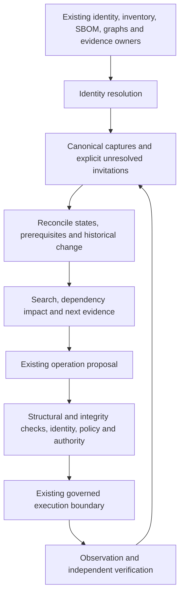

# ─── CGRF Header ───────────────────────────────────────────────
# File:        docs/development-loop.md
# Stage:       06_PLAN
# SRS:         SRS-BUILDANDDO-DEVELOPMENT-LOOP-001, SRS-BUILDANDDO-UPGRADE-001
# CAPS:        pending
# CK:          pending
# Dispatch:    VCC-BUILDANDDO-UPGRADE-001
# Seat:        BITS-CODEGEN
# Owner:       Citadel Nexus Inc.
# Created:     2026-09-21
# Depends:     libs/evolution/development.py, libs/evolution/development_sources.py, libs/evolution/intelligence.py, libs/evolution/review_packets.py, docs/verified-evolution.md, docs/capability-tokens.md, docs/submission-guide.md, libs/semantic_twin/progression.py, docs/operator-plane.md
# EnumType:    Doc
# EnumEdges:   CONSUMES libs/evolution/development.py; CONSUMES libs/evolution/development_sources.py; CONSUMES libs/evolution/intelligence.py; CONSUMES libs/evolution/review_packets.py; EXTENDS docs/verified-evolution.md; EXTENDS docs/capability-tokens.md; CONSUMES docs/submission-guide.md; CONSUMES libs/semantic_twin/progression.py; CONSUMES docs/operator-plane.md
# Intent:      Make development observations, proposed work and independent grading operable without confusing source tests with competence or competition acceptance.
# ───────────────────────────────────────────────────────────────

# Development feedback loop

The additive adapters reuse the evolution journal, deterministic compiler,
semantic graph, capability-token review policy and existing replay/promotion
gates. Run them with Python 3.11+ and the standard library. They do not activate
a private runtime, create remote issues, approve work, or deploy a candidate.

```text
Repository-authenticated GitHub observation
  → attributed information / sprint estimate
  → proposed SRS + dispatch + ActionProposal
  → frozen test-selection prediction
  → actual unittest process and retained failures
  → separately pinned independent outcome review
  → existing discovery / replay / shadow / PromotionProof gates
```

## Blueprint: developmental Semantic Twin

The primary purpose is developmental memory: where each participant is, what it
can demonstrate, what blocks it, and which evidence would justify its next step.
The Twin is **ecosystem-wide by invitation and discovery, not by a hard-coded
integration list**. It is semantic connective tissue across existing owners.
It does not become a second inventory, capability registry, policy engine,
authority ledger or verification service.

Inventory, identity, SBOM, DAG/DKG, repositories, telemetry, deployment evidence
and future owners can supply their existing versioned identities and assertions.
The operating loop is discover → understand → connect → observe → test → verify
→ operate → delegate → automate → govern/advance. Those are questions to assess,
not automatic promotions or definitions of authority tiers.



Discovery supplies a candidate fact. Evidence supplies evidentiary standing.
Policy controls its use; authority controls execution. Representation supplies
none of those permissions. Correlation and impact traversal are not causal proof.
The causality owner still needs hypotheses, mechanism, temporal evidence,
confounder assessment and an independent experiment.

### Identity, assertions and state

`libs.semantic_twin.progression` consumes the same immutable P0 v2 envelopes as
Phase 1. `Invitation` retains its source revision, observed time, original
locator, owner, proposed canonical IDs and open semantic-class labels. Identity
mapping is supplied by the existing owner, not guessed from display names.
Exactly one matching identity and owner produces a link. Missing mappings are
`UNRESOLVED`; competing mappings or owners are `CONFLICTING`. Neither produces
a new semantic entity or silently merges records. Repeating an identical
invitation is idempotent. Receiving systems must authenticate mapping producers
and enforce visibility before supplying captures; consistency is not authenticity.

Canonical envelope types and the 62 predicates stay owned by Phase 0.
Additional component classes are attributed labels, not newly minted ontology
terms. Capability, ownership, authority, composition, deployment, data/control
flow and evidence use existing canonical edges and owners. Future ontology
extensions require the existing contract/versioning path, not an ingestion
special case or a fixed per-system inclusion list.

| Dimension | Representation and meaning |
|---|---|
| Declared | Original source claims and model-owner current/target labels, with attribution |
| Discovered | Presence in the capture or invitation; no trust promotion |
| Observed / inferred / verified | Original P0 evidence state, unchanged; VERIFIED retains the typed verifier/TEVV receipts |
| Unknown / unmeasured / untargeted | Missing information, missing evidence or absent selection; never a healthy default |
| Stale / conflicting | Derived freshness/validity conditions or retained competing mappings/evidence |
| Degraded / failed / retired | Source lifecycle/runtime/evidence standing; no inferred removal or recovery |

Every consequential assertion keeps its subject revision, source, provenance,
evidence, observation time and validity. `describe` exposes the ten original
state axes separately from these projection conditions. A recapture cannot
renew an old observation. A successful producer receipt or source test cannot
replace independent verification. There is no generic `ACTIVE=true` field.

### Progression without increased authority

`ProgressionTarget` references an exact participant revision, model revision,
attributed declaration, current/target labels and exact evidence prerequisites.
The model owner determines the meaning of those labels. Missing model or
participant revisions, empty prerequisites, stale declarations, unavailable
evidence and revision conflicts stay gaps. Each prerequisite names the measured
states it accepts and the next evidence action. The default requires VERIFIED;
an OBSERVED source or provider PASS does not satisfy it.

When every declared prerequisite is supported, the projection returns
`REVIEW_CANDIDATE`, never a promoted level. Labels such as A2 → A3 or A4 → A5
remain owner declarations. This repository's authority vocabulary is A0–A3;
it does not define A4/A5 authority or convert technical maturity into a grant.
The required consequence tier remains separate, the actual authority ceiling
is unknown without its owner, and every query result carries
`authorized=false`. Existing evolution competence, independent review,
qualification, promotion and demotion contracts remain unchanged.

The resulting progression path is objective → required capability → existing
capability → evidence/test history → dependency/blocker → governing model →
review candidate → next milestone. It explains reuse, regressions and missing
proof rather than scoring development by code volume.

### Historical captures and advisory queries

`TwinCapture` binds a scope, observation boundary, unchanged canonical graph
and invitations. `Phase1Compilation.as_capture(scope_id)` reuses the compiled
objects and capture time. No second extraction, object identity or verification
is created. Each object retains its original SHA-256 leaf; the capture digest
also binds scope and capture metadata. Neither digest authenticates its producer.

`capture_at` selects an actually retained capture as of a time; it cannot
reconstruct yesterday from today's files. It rejects cross-scope histories and
different captures claiming the same time. `compare` retains before/after
subjects, states, leaf digests and changed fields. Loss of verified evidence,
new failures and stale evidence yield regression signals. Disappearance is
UNTARGETED/UNMEASURED, not retirement. Prior envelopes are never overwritten.

`search` finds literal capabilities, source assertions and gaps. `traverse`
walks dependencies or reverse impact, preserving the evidence and validity on
each returned edge. Bounded traversal reports truncation, and even an unmeasured
edge remains visibly unmeasured. These are advisory paths, not causal conclusions,
simulation validation, completeness claims or an execution API.

```python
from pathlib import Path
from libs.semantic_twin.phase1 import Phase1Inputs, compile_phase1
from libs.semantic_twin.progression import TwinCapture, describe, search, traverse

compiled = compile_phase1(Path("."), inputs=Phase1Inputs(history_limit=20))
capture = compiled.as_capture("buildanddo/public-release")
facts = describe(capture, at=capture.captured_at)
matches = search(capture, "verification", at=capture.captured_at)
# Reuse a returned canonical ID when requesting an impact path.
impact = traverse(capture, capture.objects[0].semantic_id, reverse=True)
# Choose a new, appropriately scoped local destination. Never replace history.
with Path("/tmp/buildanddo-twin-capture.json").open("x") as output:
    output.write(capture.to_json())
restored = TwinCapture.from_json(Path("/tmp/buildanddo-twin-capture.json").read_text())
assert restored.digest == capture.digest
```

Synchronization means producing another retained capture on a relevant event,
telemetry, deployment, inventory, SBOM or graph change. This implementation is a
local stdlib projection; it launches no subscriber or hosted service. Each
receiving owner still supplies authenticated observations, scope/tenant isolation,
canonical mappings, retention and its existing event transport. Raw private
evidence must not be copied into public exports.

The sprint's continuous lane lives in `docs/hostinger-sprint-closure.md`.
Business presentation and its current measurement limits live in
`docs/operator-plane.md`. Those views do not maintain competing facts.

## Capture an actual development observation

The configured `gh` CLI supplies its existing session authentication. No new
token or credential is required by this adapter. Select the repository, exact
run, attempt and source SHA independently of the returned response:

```bash
python -m libs.evolution.development --scope buildanddo/public-development capture-run \
  --repository mrnobodytx/buildanddo --run-id RUN_ID --attempt 1 \
  --candidate FULL_CANDIDATE_SHA --output state/development-loop/run-capture.json
```

Only bounded, relative, read-only Actions API paths are allowed. A capture keeps
the exact response bytes locally and validates repository, attempt, source,
chronology and complete job inventory (at most 100 jobs). Replaying the capture
with `ingest-run` does not authenticate its origin again. The journal records
`OBSERVED`, A0 provider facts: success, failure and skipped workflow conclusions
never become test results, independent verification or deployment receipts.
Unavailable jobs remain an explicit observation gap. A new capture has its own
identity; re-importing the exact capture is idempotent.

Only GitHub Actions is connected here. Other exporters retain their private
receiving dispatch and authentication requirements. Full provider bodies and
journals stay in ignored operational storage; publish only reviewed summaries.

## Propose work and run a bounded experiment

Freeze the decision before tests. The current scope is Python source under
`libs/evolution`, `libs/capability_tokens`, `libs/semantic_twin` and their source
suites under `tests/upgrade`. Each file's actual bytes are captured separately
from Git HEAD. Static AST import relationships select transitive source suites;
dynamic imports, runtime providers and application/browser behavior are outside
that selection. A selection is a hypothesis about useful tests, not evidence
that the tests are sufficient.

```bash
python -m libs.evolution.development --scope buildanddo/public-development predict \
  --changed libs/evolution/development.py --mission YOUR_APPROVED_MISSION \
  --output state/development-loop/prediction.json

python -m libs.evolution.development --scope buildanddo/public-development mission-from-run \
  state/development-loop/prediction.json state/development-loop/run-capture.json \
  --repository mrnobodytx/buildanddo \
  --srs SRS-BUILDANDDO-YOUR-SCOPE-001 --dispatch VCC-BUILDANDDO-YOUR-SCOPE-001 \
  --builder cni://agent/builder --verifier cni://agent/independent-reviewer \
  --output state/development-loop/mission-packet

python -m libs.evolution.development --scope buildanddo/public-development test \
  state/development-loop/prediction.json --output state/development-loop/test-run.json
```

Replace the example identities with receiving seats. Packet identities are
proposals; their presence does not authenticate or assign a verifier. The
packet contains a proposed SRS, dispatch, registry entry, mission and canonical
graph. The receiving owner must register/dispatch work at its existing authority
before implementation. There is no branch, issue, registry or external-write
side effect. A2/A3 authority cannot be obtained by describing additive work.

The fixed local unittest driver records counts, failures, errors, skips,
expected failures, output, times and source integrity. Empty, skipped, timed-out
or source-drifted execution cannot pass. A failed run remains in the journal;
another attempt needs a fresh prediction. Output paths are never overwritten.
Process PASS still leaves grading `UNMEASURED`.

## Admit independently graded outcomes

An independent reviewer must inspect the actual change, the frozen prediction,
broader test evidence and the retained run. They supply `OutcomeLabels` for the
exact rule, including the tests that were actually needed. Copying the selected
test list into expected labels is not independent grading. Unknown subsystem,
failure, safety or deployment outcomes stay null. Process success alone cannot
establish selection recall, absence of regressions, or judge comprehension.

```bash
python -m libs.evolution.development --scope buildanddo/public-development prepare-review \
  state/development-loop/prediction.json state/development-loop/test-run.json \
  --labels state/development-loop/reviewer-labels.json \
  --output state/development-loop/review-request.json

python -m libs.evolution.development --scope buildanddo/public-development admit-review \
  state/development-loop/review-request.json \
  --receipt state/development-loop/verification-receipt.json \
  --review-policy state/development-loop/receiving-review-policy.json \
  --output state/development-loop/replay-case.json
```

The receiving runtime supplies the existing `ReviewPolicy` independently of the
producer's packet. Its trusted verifier and exact receipt digest pins must cover
the request subject/version, prediction ID, run ID and result event ID under the
`development_outcome` check. The review must follow the run and retain A1 scope.
Distinct identifier strings alone do not establish real-world independence;
authentication and pin distribution remain receiving responsibilities. Changed
labels, source bytes, log content or policy pins invalidate the review.

Accepted labels enter the existing `ReplayCase`. The adapter preserves the
current requirement for independently reviewed successful outcome episodes;
failed and incomplete runs remain observations until a separately measured
successful repair can qualify. It never sets `verified=True` or reduces
promotion thresholds. Default promotion requires two discovery successes,
ten disjoint replay cases and five shadow cases, measured quality/safety,
known source/schema/SBOM compatibility and independent TEVV/`PromotionProof`.
Teacher agreement cannot replace truth. See `docs/verified-evolution.md` and
`docs/capability-tokens.md` for the unchanged qualification and certification flow.

### Move actual evidence to the independent reviewer

`libs.evolution.review_packets` exports the frozen prediction, actual test run,
process log and every captured source file together. Export while the source
bytes still match the prediction. The packet refuses overwrites and stays
`UNMEASURED`, including when its process passed. Failed and held runs can also
be transported; they cannot qualify as successful outcomes.

```bash
python -m libs.evolution.review_packets export --root . \
  --prediction state/development-loop/prediction.json \
  --run state/development-loop/test-run.json \
  --output state/development-loop/reviewer-packet

python -m libs.evolution.review_packets inspect \
  state/development-loop/reviewer-packet/packet.json \
  --scope buildanddo/public-development
```

The receiving seat inspects source, the actual change and broader test evidence,
then authors the labels and exact `OutcomeReviewRequest` as above. Distribute
its trusted `ReviewPolicy` separately from the producer's packet. The receiver
can use a fresh scoped journal; the importer retains the original prediction
and process events before invoking the same existing admission gate:

```bash
python -m libs.evolution.review_packets admit \
  state/development-loop/reviewer-packet/packet.json \
  --scope buildanddo/public-development --state state/development-loop/receiver.sqlite \
  --labels state/development-loop/reviewer-labels.json \
  --receipt state/development-loop/verification-receipt.json \
  --review-policy state/development-loop/receiving-review-policy.json \
  --output state/development-loop/reviewed-case.json
```

Packet hashes establish byte consistency; the receiving identity and receipt
pins establish the review boundary. A producer cannot supply its own labels as
independent evidence. Re-importing an identical review is idempotent, and a
reviewed case alone does not promote a capability. Keep real discovery, replay
and shadow cases disjoint and retain the existing promotion proof requirements.

## Keep information useful and bounded

`IntelligenceSignal` retains publisher, origin, source locator/digest, timestamps,
scope and public/licensed/authorized acquisition basis. Source text stays inert
JSON. Stale, conflicting or instruction-like claims cannot produce a sprint
packet. Sources sharing a publisher, origin or exact bytes count as one group,
including transitive copy chains. These checks flag some bad inputs; they do not
prove source identity, detect every injection, or verify advertised benchmarks.
Competitor assertions remain attributed `UNMEASURED` claims.

`DevelopmentOpportunity` binds an existing `ActionProposal` to a hypothesis,
metric, optional baseline, target and acceptance criteria. Five owner-supplied
planning weights (25/20/20/20/15) and explicit estimates produce an exact rational
impact/confidence/evidence/effort/risk score. P0 starts at 5; P1 starts at 1.
Architecture work and estimates above 180 minutes are deferred; information
quality gaps and A3 proposals are held. Weights are not an owner-reviewed rules
capture, and priority is not a predicted judge score. Opportunity roles are
claim metadata over the existing semantic vocabulary, not new graph predicates.

## Source validation and real acceptance

```bash
python -m unittest discover -s tests/upgrade -p 'test_development*.py' -v
python -m mypy --strict --explicit-package-bases libs/evolution/development_sources.py libs/evolution/intelligence.py libs/evolution/development.py
python .bits/out/VCC-BUILDANDDO-DEVELOPMENT-LOOP-001/verify.py
```

The retained dogfood uses an actual provider capture and actual local tests.
Its independent labels and real qualification remain unknown until the receiving
review exists. The full-ladder unit test uses explicitly synthetic identities,
teacher captures and receipts solely to check API composition.

Submission closure continues through the existing readiness and Day-21 tools.
The earlier `submissions/hostinger` candidate is historical. Required acceptance,
deployment/readback, authenticated browser journey, four Hostinger product
proofs, nonsynthetic replay, participant instructions and owner review must bind
the final selected candidate. A refreshed source lock or this adapter's passing
tests cannot establish `READY_FOR_OWNER_SUBMISSION`.
