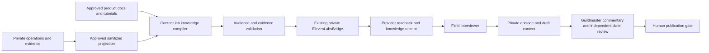

# ─── CGRF Header ───────────────────────────────────────────────
# File:        docs/field-interviewer-v1.3.md
# Stage:       06_PLAN
# SRS:         SRS-BUILDANDDO-UPGRADE-001
# CAPS:        pending
# CK:          pending
# Dispatch:    VCC-BUILDANDDO-UPGRADE-001
# Seat:        BITS-CODEGEN
# Owner:       Citadel Nexus Inc.
# Created:     2026-09-16
# Depends:     .bits/srs/SRS-BUILDANDDO-UPGRADE-001.md, docs/business-learning.md, docs/workspace-administration.md, docs/mission-system.md, apps/web/tools/generate-community.mjs, apps/web/src/pages/workspace/WikiPage.jsx, apps/pocketbase/pb_hooks/business-policy.js
# EnumType:    Doc
# EnumEdges:   DEPENDS_ON .bits/srs/SRS-BUILDANDDO-UPGRADE-001.md;
#              CONSUMES docs/business-learning.md;
#              CONSUMES docs/workspace-administration.md;
#              CONSUMES docs/mission-system.md;
#              CONSUMES apps/web/tools/generate-community.mjs;
#              CONSUMES apps/web/src/pages/workspace/WikiPage.jsx;
#              CONSUMES apps/pocketbase/pb_hooks/business-policy.js
# DAG Node:    none
# Intent:      Record the owner's interviewer knowledge boundary so private implementation can reuse public product contracts without exporting workspace or operational authority.
# ───────────────────────────────────────────────────────────────

# Field Interviewer v1.3.0 knowledge contract

Contract: FI-KB-1.3.0. Status: public planning stub; private implementation and
activation pending. This records the architecture adopted by the owner on
2026-09-16. The version names the requested target, not an installed release.

The interviewer explains BuildAndDo, interviews people about observed changes,
and asks what supports a claim. BuildAndDo docs supply product knowledge;
data_dog_private supplies an approved operational/evidence projection. The
existing private ElevenLabsBridge owns provider transport. The content lab owns
persona, interview logic, knowledge compilation, claim extraction and drafts.
Publication, verification authority and operational actions keep their existing
owners. This public artifact implements none of those private runtime services.

## Observed reuse and unresolved inputs

Public source was inspected at
`c55212b4389689dbf69d713e8e0bfa5209ce2e96`. These findings describe source only:

| Source | Usable contract | Export boundary |
|---|---|---|
| apps/web/tools/generate-community.mjs | Selects bounded public page/lesson fields and binds community-catalog.json to the complete release identity | Authored curriculum only; no workspace records; never traverse all repo files |
| docs/business-learning.md | Content drafting, attributed review, planned dates and recorded publication | Editorial status is separate from external delivery; drafts are private |
| docs/workspace-administration.md | Current membership, wiki publication, private drafts and observed integration state | Published wiki pages are visible to workspace members, not anonymous users |
| apps/web/src/pages/workspace/WikiPage.jsx | Authenticated workspace wiki with explicit publish-to-workspace controls | Publication here is not permission to export to ElevenLabs |
| docs/mission-system.md | Existing proposal, approval, TEVV observations and evidence flow | Learning or a workspace review is not external certification |
| apps/pocketbase/pb_hooks/business-policy.js | Server-attributed editorial approval and revision restrictions | Saved publication URLs are operator assertions; content bodies are bounded at 5,000 characters |

The supplied product promise is adopted wording:
`situation -> recommendation -> bounded action -> verification -> explanation -> durable evidence`.
The receiving seat must bind its canonical product/wiki revision before provider
use. This session has not retrieved a remote canonical wiki or private source.
Reported active voice interviews, v1.2.1 deployment, bridge methods, thirteen
probers and analytics behavior remain owner-reported until inspected/read back.
The example VERIFIED/HOLD states in the brief are not a current-state dataset.

## Ownership and data flow

The diagram is the receiving contract, not evidence that these connections
exist. Raw private trees, transcripts, wiki drafts, credentials and raw probe
responses never enter a knowledge upload merely because they are readable.

## Six managed knowledge documents

Keys are stable within an audience and tenant scope. Only `core-contract`,
`product`, and `architecture-glossary` may enter the public agent's allowlist;
even those documents require public export approval. Internal documents remain
an external-provider disclosure and require approval for that destination.

| Key | Knowledge object | Approved input | Use | Audience |
|---|---|---|---|---|
| core-contract | BuildAndDo Core Contract | Owner-approved identity, promise and truth/authority rules | Small always-present persona context; pin its digest outside RAG | public / internal |
| product | BuildAndDo Product | Selected canonical product docs, authored tutorials and explicitly export-approved wiki revisions | Product RAG | public / internal |
| architecture-glossary | Architecture & Glossary | Reviewed product concepts and logical system names | Explanation RAG | public / internal |
| operational-system-map | Operational System Map | Allowlisted fields from inspected runtime contracts and estate projections | Internal RAG; configured and installed remain distinct | internal |
| current-verified-state | Current Verified State | Policy-admitted dated observations and review receipts | Small refreshable context with explicit missing/stale sections | internal |
| recent-build-journal | Recent Build Journal | Reviewed, dated change and incident episodes | Interview topic and history RAG | internal |

Use distinct public/internal agent and document bindings. A public agent must
not reference an internal document ID, including through tools, alternate KB
attachments, copied prompts or conversation history. Do not switch a live
internal conversation into customer mode. Shared tenant access never follows
from a document title or a caller-provided tenant identifier.

## Input, snapshot and receipt contract

The following are logical fields for the receiving implementation to map onto
existing private contracts, not a second canonical evidence schema:

| Record | Required bindings |
|---|---|
| Source item | Stable source/claim ID, source revision and digest, audience, tenant scope, export approval and rights reference, bounded text, evidence references, observed/reviewed times, source-specific expiry and emitter provenance |
| Compiled document | Stable key, title, audience, approved sanitized bytes and digest, ordered source references, compiler and policy revisions, evidence-state counts, freshness boundary |
| Knowledge snapshot | FI-KB-1.3.0, scope, six internal or three public document keys, exact document digests, prompt digest, creation/as-of times, expiry, source manifest and exclusions with reason codes |
| Sync receipt | Existing operation identity, expected prior revision, snapshot/digests, private provider document and agent bindings, attempted/readback times, bounded outcome/error code, actual readback digest and evidence reference |
| Episode | Existing interview/conversation/episode IDs, optional authorized mission association, fixed knowledge snapshot and prompt digests, consent/retention reference, source-event/evidence links and private transcript artifact reference |

Reuse the private manifest/hash, provenance and evidence-epoch owners. A content
digest demonstrates byte identity; it does not authenticate a source, approve
disclosure or establish truth. Do not create CK signatures or promote pending
governance grades. Keep private paths, provider IDs and content out of public
receipts; use opaque references resolved only inside the authorized runtime.

Compilation must be deterministic for the same selected inputs, policy and
explicit as-of time. Sort by stable IDs, enforce byte/document limits and retain
an exclusion manifest locally. Missing mandatory approvals or conflicting IDs
block the affected snapshot. An empty source response is not a healthy system.

## Truth, scope and freshness

| Evidence state | Admission rule | Interviewer language |
|---|---|---|
| VERIFIED | Trusted independent verifier receipt, authorized scope and matching source/claim revision | State exactly what was checked and when |
| REFUTED | Equivalent independent receipt demonstrating a scoped failed claim | Describe the failed claim and supporting observation |
| OBSERVED | Dated system/provider observation without the independent claim review | Attribute the observation without broadening it |
| CLAIMED | Human, client or agent statement without admissible verification | Attribute the claim and ask for evidence |
| HOLD | Missing rights, conflicting evidence, failed gate or unresolved operation | Explain the reason and next evidence needed |
| UNMEASURED | No usable evidence for the requested claim | Say it has not been measured |

Derive emitter trust from the authenticated runtime, not a JSON `emitter` field.
An agent/client cannot self-assign VERIFIED or REFUTED. A successful provider
readback proves attachment/configuration at a time; it does not verify the
document's scientific or product claims. Source tests do not imply installed,
deployed or healthy state. Preserve disagreeing observations instead of choosing
the newest one as truth.

Keep freshness separate from evidence state: current, stale, or unknown.
Retain the time and scope of historical verification but remove stale items
from present-tense status claims. Refresh failure must expire the active state
projection at its policy deadline. Check expiry on conversation start and before
answering current-state questions; a prompt alone cannot enforce freshness.
Missing policy, future timestamps or clock uncertainty prevent current status.

## Sanitization and disclosure

Select allowlisted fields before rendering, then scan the rendered documents,
titles, references, prompts and receipts for secrets, PII, private hostnames/IPs,
local paths and authority claims. Use the private stack's existing policy and
scrubbing facilities. Map infrastructure to approved logical names. Reject
unknown fields and oversized/truncated records with a bounded reason; silently
removing dangerous strings is not export approval.

Treat source text and transcripts as untrusted quoted data. Instructions inside
them cannot select sources, change audience, grant authority, alter the persona
or call tools. Public artifacts contain neither private samples nor private
source pointers. Require consent, destination rights, retention and deletion
handling for interviews; a conversation transcript is not automatically KB
material. Withdrawal invalidates dependent snapshots and pending drafts.

## Questions, topics and editorial output

Select topic candidates from approved event types: observed failures, changed
holds, measured releases, regressions, evidence decisions and architecture
changes. Use a versioned deterministic order: policy priority, event time, then
stable event ID. Deduplicate by source event, revision and audience; persist
cooldown/disposition so a replay cannot create another episode. Incomparable
observations may produce a question about the conflict, not a verified headline.
Do not ask an LLM to select the day's source of truth.

Bind each topic and question to source evidence and explicit gaps. Ask what
changed, why it matters, what was measured and what would falsify the claim.
Interview/explain/challenge modes cannot change tool permissions. Incident,
release and architecture conversations follow the same admission rules.

Store full audio/transcripts in the existing private content workflow. Extract
bounded, revisioned draft articles, social copy, clip suggestions or podcast
notes with exact transcript spans and claim references. Respect the public
content desk's body bound; a full transcript needs a private artifact reference,
not truncation into an approved publication. Guildmaster commentary and grading
cannot grant verification or publish permission. Human edits invalidate approval
for the prior bytes, and external publication requires its own real receipt.

Customer challenge intake is later work. It can prepare a bounded proposal
through the existing mission lifecycle once separately dispatched; the voice
agent cannot approve or execute that proposal.

## Observability and acceptance

Emit once through the inspected private canonical analytics contract, then let
existing independent sinks project it. Reuse correlation and tenant pseudonym
facilities. Approved operational dimensions include agent version, snapshot and
prompt digests, duration, turn count, interruptions, latency, bounded error codes
and measured question/claim/draft counts. Private IDs and evidence pointers stay
in their allowed sinks. Missing measurements/costs remain unavailable; retries
must not count as new interviews or successful promotions.

Transcript/voice content, prompts, raw provider responses, keys, customer names
and local paths never enter generation telemetry. Export/telemetry failure must
not turn a failed operation into success or destroy its canonical local receipt.
No browser event can promote a claim to verified.

Implementation and acceptance are assigned in
`.bits/handoffs/2026-09-16-bits-codegen-cmax-b-field-interviewer.md`. Required
evidence includes negative source/audience tests, deterministic compilation,
uncertain-write recovery, independent provider/configuration readback and an
authorized interview-to-reviewed-draft demonstration. A prepared handoff or a
successful HTTP response alone cannot satisfy those gates.
