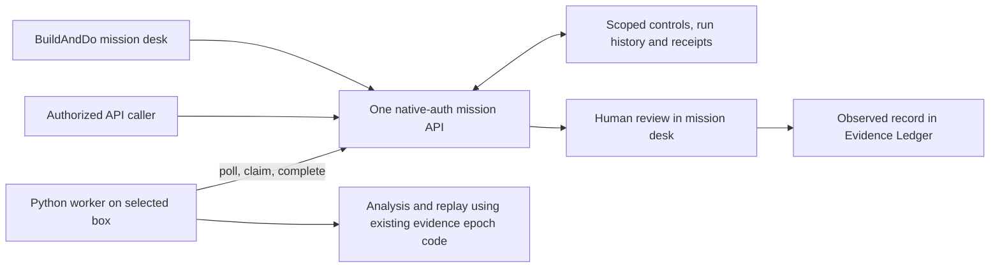

# ─── CGRF Header ───────────────────────────────────────────────
# File:        docs/mission-suite.md
# Stage:       06_PLAN
# SRS:         SRS-BUILDANDDO-UPGRADE-001
# CAPS:        pending
# CK:          pending
# Dispatch:    VCC-BUILDANDDO-UPGRADE-001
# Seat:        BITS-CODEGEN
# Owner:       Citadel Nexus Inc.
# Created:     2026-09-16
# Depends:     apps/mission_suite/__main__.py, apps/pocketbase/pb_hooks/suite.pb.js, apps/pocketbase/pb_migrations/data/government-submissions.json
# EnumType:    Doc
# EnumEdges:   CONSUMES apps/mission_suite/__main__.py; CONSUMES apps/pocketbase/pb_hooks/suite.pb.js; CONSUMES apps/pocketbase/pb_migrations/data/government-submissions.json
# DAG Node:    none
# Intent:      Explain the callable box-worker suite and government-submission mission with reproducible source checks and explicit runtime acceptance.
# ───────────────────────────────────────────────────────────────

# BuildAndDo mission suite

The suite connects one BuildAndDo mission API to a portable Python worker on an
operator-selected box. It provides **maritime observation analysis** and
**government-submission readiness review**. The website, API clients and worker
use the same native PocketBase authentication and mission permissions.



The worker needs Python 3.11 or newer and its standard library. It opens no
inbound port and polls only its configured BuildAndDo API. The existing
PocketBase application still owns authentication, persistence and the HTTP
surface. It must receive the suite hooks and migrations through its normal
release process; unpacking the worker alone does not install that API.

## Create the mission and learn the submission process

1. In **Challenge Desk**, choose **Start a mission**, then **Use government
   submission starter**. Review the proposed scope, actual opportunity, baseline,
   authority and TEVV criteria. Saving creates a proposed mission under the
   signed-in user and active workspace; it does not approve the plan.
2. Open **Government submission learning path**. Its eight lessons cover the
   official notice, eligibility and authority, capability evidence, the solution
   brief, costs and rights, security/CUI boundaries, demo/readiness evidence, and
   submission receipts and transition. Each has a worked explanation, practical
   exercise, knowledge check and official starting-point references.
3. Use the existing mission approval and **Record work started** flow. A saved
   mission must be running before a member can queue suite work.
4. Open the mission's **suite and submission review** link. An owner or admin
   enables this mission's suite. Source-rights configuration is required for
   maritime observations; submission review does not need observation sources.
5. Queue a bounded analysis, inspect its recorded status, then review the actual
   result. **Attach reviewed result to mission** creates an **observed** evidence
   record. Existing evidence and mission review controls retain responsibility
   for verification and outcome closure.

Lessons work as readable previews until their additive migration is installed;
only installed lesson IDs can receive saved per-account progress. The public
community feed contains the same eight new lessons alongside the original 25,
so existing Discord lesson search and quizzes can expose them after deployment.
Neither a tutorial completion nor a suite result files a government proposal.

The starter requires selection of a real opportunity. The 15-slide/10-page and
48-hour examples in the Sentinel planning baseline are not universal rules or
verified requirements for a current solicitation. Use its current official
instructions, amendments and designated submission channel.

## API contract

All operations use:

```text
POST /api/buildanddo/workspaces/{workspace}/suite
Authorization: existing native PocketBase user session
Content-Type: application/json
Cache-Control: no-store
```

The request has exactly these fields:

```json
{
  "action": "snapshot",
  "mission": "actual-mission-id",
  "revision": 0,
  "request_key": "caller-stable-request-key",
  "payload": {"page": 1}
}
```

Use a unique 16–80 character alphanumeric, underscore or hyphen request key for
each mutation. If delivery is uncertain, retry **the exact same body and key**.
Do not start a different change until its receipt is recovered. Receipts store
the command fingerprint and small outcome, not another copy of the input.

| Action | Permission and payload | Revision |
|---|---|---|
| `snapshot` | Current mission reader; `{page}` | 0 |
| `detail` | Current mission reader; `{id}` | 0 |
| `configure` | Workspace owner/admin; `{enabled, rights, parameters}` | Saved control revision, initially 0 |
| `enqueue` | Current owner/admin/editor of a running mission; `{suite, input}` | Saved state revision |
| `cancel` | Current mission writer; `{id}` | Saved run revision |
| `retry` | Current running mission writer; `{id}` | Saved run revision |
| `attach` | Current mission writer; `{id, note}` | Saved ready run revision |
| `poll` | Exact registered worker; mission `""`, `{page}` | 0 |
| `claim` | Exact registered worker; `{id}` | Queued or expired run revision |
| `complete` | Current worker lease; `{id, attempt, result_canonical, failure, source_sha256}` | Claimed run revision |

The result repeats workspace, mission, action and outcome identity. Mutations
carry `replayed`; reads return a scoped snapshot or record. Histories and queues
paginate 20 rows. Run states are `blocked`, `queued`, `processing`, `ready`,
`failed`, `cancelled`, `attached`. A worker binding is configuration evidence,
not proof that the process is healthy. Actual runs supply that evidence.

Native API rules, current workspace membership and mission readability are
checked on each request. Worker execution rechecks the submitting user's current
permission, source/configuration binding and running mission state. Three leased
attempts are allowed; each lease lasts 120 seconds. A new lease fences old
attempts. Results, control advancement and retry receipts commit in one
transaction. Raw suite collection APIs are closed. Native PocketBase acceptance
remains a distinct gate from the storage-double tests below.

## Maritime input and output

`suite` is `maritime`. `input` is `{observations: [...]}` with 1–128 added
observations and at most 256 retained observations per mission window. Each
observation has exactly:

```text
observation_id, source_id, source_record_id, entity_id,
event_time, latitude, longitude
```

Use UTC timestamps and WGS84 coordinates. The API adds its receipt time. A
source record and observation identity cannot later name different data. Each
configured source right includes `source_id`, `rights_id`, `license_ref`,
`classification` (`PUBLIC` or `COMMERCIAL`), `processing_allowed`,
`export_allowed`, `expires_at`, `independence_group`. CUI is excluded. Sources
from the same upstream supplier share an independence group. The operator must
confirm that the rights cover this workspace's actual processing and readers.

The retained input includes the full observation history, the used rights,
parameters, tenant/mission and a frozen evaluation clock. State uses event-time
order, preserving late records and contradictions. Association is the supplied
exact entity-identifier claim; this is not a validated maritime identity
resolver. Conflicting positions remain unresolved instead of selecting a truth
position by arrival order. The engine computes observation gaps, apparent-speed
discontinuities and position conflicts. A gap may be receiver coverage loss and
is not evidence of criminal activity or deliberate AIS shutdown.

Parameters are `gap_seconds` (60–86400), `max_speed_knots` (1–100),
`position_tolerance_m` (10–100000) and `stale_seconds` (60–604800). Defaults are
900, 45, 5000 and 3600. They are configurable analysis thresholds, not calibrated
operational performance claims. Output contains normalized observations, entity
history, features, candidates and GeoJSON points. Every candidate remains
**HOLD**, confidence is uncalibrated, and `admitted_cues` is empty.

No live source is fetched, government cue sent or NNC authority created. These
remain integration work for their existing owners. The API accepts permitted
observations from an existing caller; a manual or fixture observation must not
be described as a live feed integration.

## Submission-readiness input and output

`suite` is `submission`. `input` has `requirements` and `document`.

Each of 1–50 requirements has `id`, `criterion`, `source_url`, `source_revision`,
`evidence_ids` (up to 20), `status` (`open`, `satisfied`, `not_applicable`) and
`justification`. The API resolves evidence from the same readable mission and
freezes its identity, type and fingerprint. Changed or newly inaccessible
evidence requires a fresh review; the worker cannot retain stale verification
as current readiness.

The document has `name`, `sha256`, `format` (`deck` or `paper`), `pages`,
`max_pages`, `rule_url`, `rule_revision`, `deadline`. The browser fingerprints a
selected rendered PDF locally without uploading document bytes. A human records
the inspected page/slide count and the limit from the current rule. API callers
supply those same declarations and their real artifact fingerprint.

The checker rejects malformed inputs and identifies missing official references,
open requirements, missing or unverified evidence, unexplained non-applicability,
expired deadlines and declared counts exceeding the cited limit. Official
references must be HTTPS on a `.gov` or `.mil` domain; those pages are **not
fetched**. A matching hostname does not establish that a cited rule is current or
applicable. PDF content, format quality, eligibility, legal representations and
security compliance require human review.

Output is `NEEDS_EVIDENCE` or `READY_FOR_HUMAN_REVIEW`. The latter means the
declared inputs passed this bounded check. `submission_receipt` stays null. An
authorized human must submit using the actual notice and retain the actual
portal acknowledgment. Receipt, selection and award remain separate facts.

## Package and run on a selected box

These local commands inspect source and create an archive; they do not install
services or write to an external system:

```bash
python -m apps.mission_suite identity
python -m apps.mission_suite package /tmp/buildanddo-mission-suite.tgz
```

The archive contains an explicit source closure for the mission worker and the
model-independent federal portfolio compiler, their opportunity catalogue, guides,
proposed lane specifications and `suite-manifest.json`, plus root distribution
terms when present. It excludes workspace
data, environment files, credentials and deployment controls. It is reproducible
for the same file bytes. The source fingerprint binds engine, worker, portfolio
source/catalogue and reused transport/evidence code. The manifest is a source
closure; it is not a generated
container/runtime SBOM or a release-admission receipt.
After its source gates pass, the independent mission-suite CI job retains this
archive as `buildanddo-mission-suite-python-3.11` or `buildanddo-mission-suite-python-3.12`
for operator download and review. Artifact availability is not activation.

After the receiving operator has accepted the source, installed the API through
the existing application pipeline and chosen the box:

- Supply `BUILDANDDO_POCKETBASE_URL`, `BUILDANDDO_SUITE_WORKSPACE` and the native
  worker user's `BUILDANDDO_SUITE_TOKEN` through the approved runtime secret
  mechanism. Do not store a token in this repository, a shell example or mission
  evidence. The worker has no superuser shortcut or alternate authentication.
- On PocketBase, bind `BUILDANDDO_SUITE_BINDINGS` to a JSON list of records with
  `workspace`, `worker_user`, `binding`, `source_sha256`, `enabled`. Use the exact
  source fingerprint from the installed archive. Only the named worker may
  claim/complete jobs. A binding change invalidates unfinished work.
- From the unpacked directory, the operator can run the read-only prerequisite
  diagnostic, then explicitly start the worker. The diagnostic does not call
  the API or prove that the native credential works.

```bash
python -m apps.mission_suite doctor
python -m apps.mission_suite worker --once
```

`worker` without `--once` polls until stopped. This invocation performs the
authorized API writes; no service manager, box credentials, network listener or
deployment configuration is supplied here. The receiving operator owns TLS,
process supervision, least-privilege identity, token lifecycle, disk access,
backups, native schema acceptance and rollback. An existing CPU box is sufficient
for this bounded implementation; no GPU placement is required.

Each completed operation emits a JSON log with outcome, reason, elapsed
milliseconds, version, source fingerprint, tenant/mission/run identifiers and
governance tags. Observation and document contents are excluded. Browser
mutations use the existing observed-mutation layer. Collecting the box logs into
the existing telemetry pipeline requires the receiving operator's binding; no
Datadog dashboard or live telemetry is claimed by source existence.

## Replay and validation

`detail` returns the retained `input_canonical`, `result_canonical` and parsed
`result` to a current permitted reader. Save the two canonical strings verbatim
as `input.json` and `result.json`, preserving their UTF-8 bytes and the same
access/retention policy. Check their SHA-256 hashes against `input_sha256` and
`result_sha256`. The parsed `result` is for display: reserializing it can change
numeric spelling and break exact replay. Then use the matching package:

```bash
python -m apps.mission_suite analyze input.json
python -m apps.mission_suite replay input.json result.json
```

Replay compares the complete result and returns a nonzero exit code for
`DIVERGED`. Proof leaves bind input bytes, analysis, engine version and exact
source closure through **the existing** `scripts/ci/evidence_epoch.py`. This
fingerprint is evidence, not signing, NNC admission or deployment authority.
Release state remains HOLD even for a matching replay.

Run source validation from the repository root:

```bash
node --test tests/upgrade/suite-system.test.mjs tests/upgrade/suite-client.test.mjs tests/upgrade/government-learning.test.mjs
python -m unittest discover -s tests/upgrade -p 'test_mission_suite.py'
python tests/upgrade/check_mission_suite.py
python tests/upgrade/test_suite_native.py --require-binary
python -m mypy --strict --explicit-package-bases --follow-imports=silent apps/mission_suite
python -m ruff check apps/mission_suite
```

Cross-language tests execute the real Python worker/engine and JavaScript API
source against transactional storage and authentication-boundary doubles.
They test retries, revocation, lease fencing, source/mission isolation, evidence
review, retained contradictions and package replay. They do not substitute for
native PocketBase schema/rule tests or rendered browser interaction tests.
The latter suites are authored in the web test tree and run with the normal
Vitest command when frontend dependencies are installed.
The independent suite CI job requires source tests and per-module coverage on
Python 3.11 and 3.12. Both declared PocketBase runtimes must pass the native suite
gate; a missing binary fails the required command instead of producing acceptance.

## Acceptance and rollback

This source continuation implements a reusable public mission suite and learning
path. It supersedes the requirement to locate Sentinel source **for this package**;
it does not fulfill or mark accepted the earlier private Sentinel work orders.
Counting planning documents or dispatch phases is not a measure of Maritime
product completion.

Before describing a box deployment as operating, retain: native migration and
authorization results for the deployed PocketBase version, rendered mission
creation/configuration/review evidence, exact package identity, an actual
authenticated worker completion, observed telemetry and a stop/rollback rehearsal.
Live feed integration, calibrated maritime metrics, existing NNC admission,
government handoff and CUI handling remain separate unresolved acceptance gates.

For application rollback, disable the workspace worker binding or mission suite,
stop the worker and roll back the public application through its current owner.
The suite migration's down path removes protocol markers and retains input,
result and retry history. Re-up validates schema and restores the markers. The
lesson migration down path retains lessons and progress; it never deletes
learners' evidence. Source/API restoration is required to remove UI entry points.
Changes to already-applied private infrastructure remain outside this package.

Owner: Citadel Nexus Inc.
