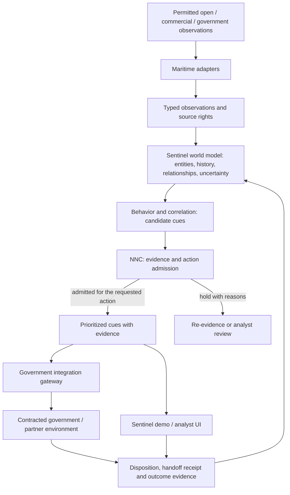

# ─── CGRF Header ───────────────────────────────────────────────
# File:        docs/sentinel-maritime/blueprint.md
# Stage:       06_PLAN
# SRS:         SRS-BUILDANDDO-UPGRADE-001
# CAPS:        pending
# CK:          pending
# Dispatch:    VCC-BUILDANDDO-UPGRADE-001
# Seat:        BITS-CODEGEN
# Owner:       Citadel Nexus Inc.
# Created:     2026-09-16
# Depends:     .bits/srs/SRS-BUILDANDDO-UPGRADE-001.md, docs/sentinel-maritime/contracts.md, docs/sentinel-maritime/system-plan.json, docs/sentinel-maritime/integrity.md
# EnumType:    Doc
# EnumEdges:   DEPENDS_ON .bits/srs/SRS-BUILDANDDO-UPGRADE-001.md; CONSUMES docs/sentinel-maritime/contracts.md; CONSUMES docs/sentinel-maritime/system-plan.json; CONSUMES docs/sentinel-maritime/integrity.md
# DAG Node:    none
# Intent:      Freeze the owner's maritime product decisions and separate them from capability and solicitation evidence still needed for the DIU deck.
# ───────────────────────────────────────────────────────────────

# Sentinel Maritime Intelligence Engine — product baseline 1.1

Baseline: `SM-BL-1.1`, recorded 2026-09-16 from the owner's supplied blueprint,
white-paper outline and master implementation contract. Supersedes `SM-BL-1.0`
at the historical planning revision identified in `system-plan.json`.
Decision owner: Dmitry Richard, Citadel Nexus Inc. Engineering records the
owner-authored design here; this is a public planning artifact. Maritime
implementation, an operating system SBOM and government acceptance are pending.

**Evidence-backed maritime world modeling, anomaly detection, threat cueing and
target handoff for existing maritime domain awareness systems.**

Sentinel turns permitted maritime observations into persistent, evidence-backed
state and explainable, prioritized cues. Government systems consume the cues and
their provenance. Sentinel's analyst UI supports demonstrations and review; a
customer need not adopt it as an operational common operating picture (COP).

## Frozen decisions

| ID | Decision |
|---|---|
| DEC-01 | Sell Sentinel Maritime Intelligence Engine as the Deep Blue capability. Citadel is its underlying architecture; BuildAndDo supplies workflow/evidence functions behind the scenes. |
| DEC-02 | Keep observations, identity hypotheses, observed state, inferred behavior and analyst judgments distinct. Preserve uncertainty and conflicting evidence. |
| DEC-03 | Evaluate a composite detector architecture: deterministic, temporal, graph and statistical features, optional ML and external intelligence. A cue explains reasons for analyst attention. |
| DEC-04 | NNC evaluates whether a specific surfacing, escalation, cross-cueing or handoff action has sufficient evidence and authority. Missing support holds that action; an explicit prohibition denies it. |
| DEC-05 | Prioritize government API/data handoff. Implement destination adapters against contracts supplied by the receiving authority. |
| DEC-06 | Trace every cue revision through observations, rights, model/detector/policy versions, release identity, disposition and outcome. |
| DEC-07 | Keep release, evidence-epoch and data-rights commitments separate. Use the existing integrity owner; introduce no second Merkle implementation. |
| DEC-08 | Limit Phase 1 to permitted public/commercial data. Introduce CUI only inside a separately accepted processing and proof boundary. |
| DEC-09 | Separate software licensing from data rights and costs. Support customer-provided data or an optional transparently priced data bundle. |
| DEC-10 | Publish measured results with methods and denominators. Unmeasured values remain targets to agree, without invented numbers. |
| DEC-11 | Freeze the design version for deck consistency; revise claims only when their evidence changes. A new design revision records which decision it supersedes. |
| DEC-12 | Extend the existing Sentinel at https://sentinel.citadel-nexus.com. Discover the existing UI, auth, services, graph, evidence, NNC and release owners before code. No parallel product shell or duplicate Merkle implementation. |
| DEC-13 | Require tenant and mission scope through objects, graph queries, subscriptions, replay and exports. Separate public, commercial and future CUI evidence/proof domains. |
| DEC-14 | Produce one self-contained submission format from one claim baseline. Keep company facts, official requirements, source evidence and runtime acceptance independently qualified. |

Revision 1.1 records the owner's latest decisions: DEC-12–14 are added; DEC-04
is refined by separating CandidateCue, three admission verdicts and orthogonal
SUPPRESS/ESCALATE dispositions; DEC-07–08 gain explicit commercial proof isolation
and detached cue/proof/epoch receipts. A known prohibition yields DENY, whereas
missing conditions yield HOLD. The 1.0 source fingerprints remain unchanged.
The seven-part paper is `white-paper.md`; the private execution contract and
all 13 work orders are `implementation-contract.md` and `work-orders.json`.

The exclusions remain explicit: no satellite constellation, new maritime sensors,
UAS/USV/UUV platform, replacement government COP, black-box criminality verdict,
LLM selection of military targets, classified Phase 1 processing or autonomous
kinetic action. Here, "target handoff" means an authorized subject-of-interest
data cue for human review; it carries no weapon tasking or authority to use force.

## Product architecture

Government observations are a later, separately permitted input. The diagram
does not establish access to any source or receiving system. The component/plane
mapping is `system-plan.json`; canonical field and metric definitions for this
design are in `contracts.md`; integrity ownership is in `integrity.md`.

Sextant, SPAR, MAGE and CSII are integration targets named in the owner's brief.
No interface specification, credential, test endpoint or successful integration
with those environments was inspected in this repository. Their names may appear
in the deck as intended destinations, with integration subject to supplied APIs.

## Existing foundation and maritime specialization

| Foundation | Evidence in this checkout | Deep Blue specialization / remaining evidence |
|---|---|---|
| BuildAndDo bounded missions, research, evidence and personal dossiers | Application modules and local-test reports exist. Native/backend/browser and deployment acceptance remain pending. | Map admitted maritime cues and outcomes to bounded missions; keep private personal dossiers separate from maritime subject records. |
| Source provenance and evidence epochs | A candidate-only source manifest and non-authoritative Merkle epoch producer/verifier exist. | Receiving owner supplies actual image, dependency closure, runtime receipts and the authoritative release/admission contract. |
| Datadog and supply-chain reporting | Instrumentation, report-only dependency/license checks and CI configuration exist. | Maritime detector/analyst/cost measurements and actual ingestion evidence. |
| Sentinel state, DKG, causal/temporal/provenance graphs, NNC | Owner-reported foundation; its private implementation and runtime are outside this inspection. | Confirm reuse with exact source, interface, image and acceptance evidence; then specialize ontology, detectors and policy. |
| NATS, PostgreSQL/Supabase, FAISS, LangGraph, PostHog and private release services | Proposed dependencies from the owner's brief; not a verified installed inventory here. | Private component owners provide versions, digests, licenses, interfaces and dependency closure. |

BuildAndDo in this checkout uses PocketBase. The proposed Sentinel PostgreSQL /
Supabase state layer does not imply a BuildAndDo database migration or a shared
identity/storage model. That boundary needs an explicit adapter contract.

Deck-safe current wording: "The design reuses Citadel foundations, subject to
component verification, and extends BuildAndDo's existing mission/evidence
source. Deep Blue work specializes maritime state, detectors, measurement and
government integration." The stronger claim "we already operate the full state,
graph, provenance and governance infrastructure" requires receiving-seat runtime
evidence for each cited capability.

## Maritime behavior and analyst use

Candidate detector families include route deviation, unusual loitering,
rendezvous, identifier inconsistency, disappearance/reappearance, unusual port
or zone transitions, correlated activity and conflicting observations. Each
needs its own features, reference population, operating context and validation.
Missing observations, receiver coverage, weather, lawful transfers and stale
registries can explain apparent anomalies. Correlated sources cannot count as
independent corroboration merely because they have different providers.

The cue expresses "this subject merits attention because these events occurred
in this window, supported and contradicted by these sources." It cannot equate
an anomaly, association or NNC verdict with smuggling, piracy or guilt. Analyst
dispositions remain attributed judgments; they become benchmark labels only
through the agreed adjudication procedure.

## Phase 2 demonstration design

The owner's brief describes approximately 48 hours of pre-demo real-time
operation and use cases involving narcotics smuggling, human smuggling and
piracy. These solicitation details await official references in the register
below. The windows here are a rehearsal plan, not measured service guarantees.

| Window from authorized T0 | Planned activity | Exit evidence / fallback |
|---|---|---|
| 0–2 h | Validate permission/scope, connect permitted sources and establish initial world state. | Source receipt, clock/coverage checks, missing-source report. Initial state is not a historical behavioral baseline. |
| 2–12 h | Associate observations and assemble track/route history. | Versioned association hypotheses and continuity/gap report. Use only permitted historical data; otherwise mark cold-start uncertainty. |
| 12–24 h | Evaluate candidate features and cross-source patterns. | Feature snapshots, detector versions, candidates including negative controls. A qualifying event can produce a cue immediately; the windows do not delay alerts. |
| 24–36 h | Evaluate NNC admission, review priorities and test suppression/escalation. | Supporting/contradicting evidence, admitted proofs, held/denied candidates and reasons. |
| 36–48 h | Produce permitted machine-readable handoff, replay and metric review. | Time-bounded manifest, denominator-based results, simulated-versus-actual receipt labels and export review. |

Configure geography, authorized use, observation interval, source budget,
recipient, data rights and evaluation rules before T0. A feed outage produces a
coverage gap, not a healthy detector result. No qualifying event is a valid
result. A labeled replay may demonstrate mechanics but must be clearly separated
from the live run. Do not manufacture suspicious activity to fill a slide.

From any demonstrated cue, an analyst must be able to inspect what happened,
why it is unusual, supporting and disagreeing sources, event/ingest/detection
times, confidence and its changes, proposed next collection, the action-specific
handoff decision and replay inputs. Collection recommendations require separate
authorization before execution.

## Commercial and security boundaries

The software license covers synthesis, persistent state and cueing. Data can be
customer-provided (BYOD) or an optional managed commercial bundle, with source
license limits and pass-through costs visible. Geography/mission volume,
integration work and support can be priced separately. Amounts, SLA promises,
licensing terms and unit economics remain uncommitted until measured and agreed.
BYOD still requires evidence of the customer's processing and redistribution
rights. Publicly accessible data is not automatically licensed for every use.

Phase 1 uses permitted public/commercial inputs. Later CUI processing needs an
accepted system boundary, access/export controls, data and model isolation,
approved cryptographic modules, audit, training and media/retention handling.
The precise MOU, attestation, NIST SP 800-171, FIPS validation and DFARS duties
must come from the applicable contract and security authority. No certification
or compliance status is asserted. CUI is controlled unclassified information;
classified data remains outside this baseline.

## Requirement and claim register

The owner's two supplied fragments are `BRIEF-2026-09-16`. No official
solicitation/FAQ URL, revision or page was supplied or inspected. References below
must be resolved before an externally submitted deck calls them DIU requirements.

| ID | Briefing assertion | Verification needed |
|---|---|---|
| REQ-01 | Commercial multi-source maritime synthesis and existing-interface integration are preferred. | Official solicitation and FAQ revision, item/page and exact integration wording. |
| REQ-02 | Phase 2 includes real-time activity with roughly 48 hours before demonstration. | Official timing, permitted sources, historical data, geography and evaluation conditions. |
| REQ-03 | Narcotics smuggling, human smuggling and piracy are Phase 2 use cases. | Official use-case definitions and adjudicated evaluation labels. |
| REQ-04 | Speed, accuracy, operational value, analyst effectiveness, cost and scalability are scored. | Scoring rubric, denominator/measurement agreement and any mandated thresholds. |
| REQ-05 | Sextant, SPAR, MAGE and CSII are relevant receiving environments. | Named interfaces, disclosure permissions, sandbox and recipient acceptance contract. |
| REQ-06 | Later controlled data requires the listed CUI/security duties. | Applicable clauses, versions, MOU and security authority's evidence checklist. |
| REQ-07 | Software license fees and data costs must be described. | Submission format, required pricing granularity and rights assumptions. |
| REQ-08 | Submit one solution document: a 16:9 deck up to 15 slides OR a white paper up to 10 pages. | Official solicitation/FAQ revision and portal constraints, including any appendix/cover rules; verify rendered pages before submission. |
| REQ-09 | Technical and company viability include ability to develop, deliver and sustain the solution. | Official rubric and dated company-approved team, staffing and sustainment evidence. |
| REQ-10 | Existing customer base and commercial traction must be described. | Official requested fields and permitted, dated aggregate customer/ARR/pilot evidence; no numeric values supplied here. |

`system-plan.json` records planned lifecycle using exactly REUSE, EXTEND and
BUILD. These are design dispositions, not evidence of operation. Every component
has a separate evidence state and `runtime_verified: false` at this baseline.
Admitted REUSE in a delivered SBOM requires the proofs in `integrity.md`.

## Fifteen-slide derivation map

This is a content map for the next deck artifact. Each slide must retain the
claim qualification below; it is not a completed or submitted presentation.

| Slide | Subject | Baseline anchor / qualification |
|---|---|---|
| 1 | Sentinel Maritime: commercial cueing for existing MDA | DEC-01, DEC-05; product definition. |
| 2 | Fragmented observations and analyst burden | REQ-01; brief-sourced need until official reference is attached. |
| 3 | Product boundary and customer workflow | Architecture, exclusions; no autonomous action. |
| 4 | Foundation we can demonstrate | Source evidence table and inventory; owner-reported runtime claims stay qualified. |
| 5 | Deep Blue specialization | DBO-001–DBO-016; proposed funded work. |
| 6 | Evidence-backed vessel world model | DEC-02 and Observation/Entity contracts; planned ontology. |
| 7 | Composite behavior/correlation | Candidate families; no criminality or current accuracy claims. |
| 8 | NNC admission and human authority | DEC-04 and AdmissionDecision; action-specific holds. |
| 9 | Explainable ThreatCue dossier | ThreatCue contract; synthetic examples labeled if later added. |
| 10 | Government integration gateway | DEC-05, REQ-05; no existing integration asserted. |
| 11 | SBOM, release and evidence integrity | DEC-06–07, integrity contract; no computed maritime root asserted. |
| 12 | 48-hour demonstration | REQ-02–03 and rehearsal plan; timing subject to official terms. |
| 13 | Performance, analyst value and economics | Metric contract, REQ-04; all results/targets pending. |
| 14 | Public-data phase and later CUI boundary | DEC-08, REQ-06; no certification assertion. |
| 15 | Commercial offer, team and next phase | DEC-09, DEC-14, REQ-07/09/10; licensing/data split, owner-reported team, no invented customer or dollar figures. |

The paper and deck are alternative expressions of this baseline. A deck built
from this map must retain its scenario, capability qualifications, measurement
method and integration/commercial boundaries without relying on a second paper.
`system-plan.json` maps the seven paper sections to these slide numbers and
tracks submission HOLD, pending company facts and unverified official sources.
No deck or paginated PDF is generated or submitted by the current continuation.

Brand hierarchy: **Sentinel** observes and models; **NNC** evaluates support and
authority for a cue action; **Citadel** preserves evidence, state, provenance and
mission history. BuildAndDo appears only when explaining implementation evidence.

Changes to product decisions require an owner-reviewed baseline revision. New
measurements can update the evidence inventory without rewriting historical
claims. Private implementation and official-requirement resolution are assigned
in `.bits/handoffs/2026-09-16-bits-codegen-cmax-b-sentinel-maritime.md`.
