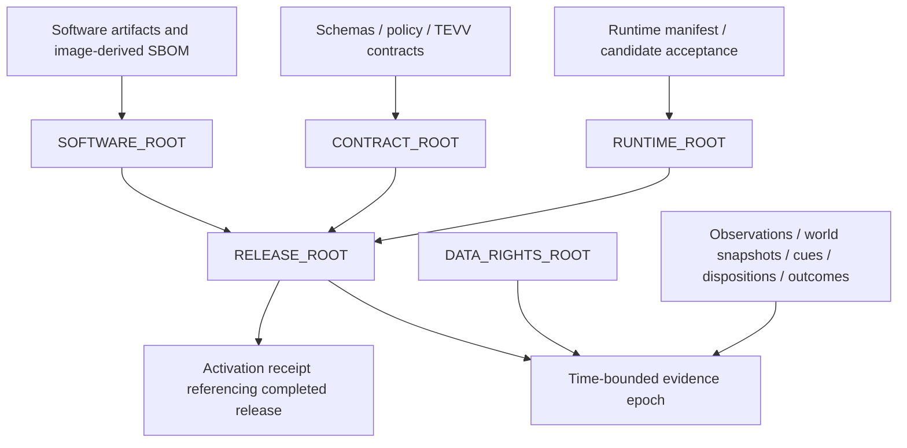

# ─── CGRF Header ───────────────────────────────────────────────
# File:        docs/sentinel-maritime/integrity.md
# Stage:       06_PLAN
# SRS:         SRS-BUILDANDDO-UPGRADE-001
# CAPS:        pending
# CK:          pending
# Dispatch:    VCC-BUILDANDDO-UPGRADE-001
# Seat:        BITS-CODEGEN
# Owner:       Citadel Nexus Inc.
# Created:     2026-09-16
# Depends:     docs/sentinel-maritime/system-plan.json, scripts/ci/evidence_epoch.py, scripts/ci/candidate_manifest.py, scripts/ci/supply_chain.py
# EnumType:    Doc
# EnumEdges:   CONSUMES docs/sentinel-maritime/system-plan.json; CONSUMES scripts/ci/evidence_epoch.py; CONSUMES scripts/ci/candidate_manifest.py; CONSUMES scripts/ci/supply_chain.py
# DAG Node:    none
# Intent:      Assign the maritime release, rights and evidence commitments to the existing integrity owner without inventing Merkle authority or a live system SBOM.
# ───────────────────────────────────────────────────────────────

# Sentinel Maritime integrity and SBOM contract 1.0

Part of `SM-BL-1.0`. This freezes the map and proof obligations. Actual release
roots, image digests, generated system/package SBOMs, runtime receipts and
operational evidence epochs have not been materialized for Sentinel Maritime.
`system-plan.json` is a versioned planning inventory, not a live SBOM.

## Existing owner and evidence limits

| Artifact | What was inspected | Authority limit |
|---|---|---|
| `scripts/ci/evidence_epoch.py` | Existing BuildAndDo `sha256-merkle-v1` file/commit/previous-root construction and verifier. | Explicitly evidence-only; missing inputs can be recorded as absent. It is not a mandatory release or NNC admission gate. |
| `scripts/ci/candidate_manifest.py` | Hashes tracked source files and emits a self-hashed, candidate-only provenance manifest. | Does not attest the running image, container contents or government acceptance. |
| `scripts/ci/supply_chain.py` | Direct-dependency license inventory, advisories and lock consistency checks. | Does not establish a complete system/runtime SBOM or source redistribution rights. |
| Owner-cited `tools/citadel_evidence_epoch.py` | Path and intended ownership supplied in the brief; no file was available in this checkout. | Private receiving owner must provide the implementation/version and recomputation/admission contract. No compatibility is assumed. |

Use the receiving owner's existing tool and canonical serialization, domain
separation, leaf ordering, duplicate handling and proof format. No new hash
construction or CK signing logic is introduced here. The composition diagrams
are references between typed artifacts, not an instruction to concatenate strings
and compute an alternative root. A normal source-file SHA-256 in the planning
inventory fingerprints inspected bytes; it is not a maritime Merkle root.

For an existing permitted BuildAndDo epoch manifest, the established command is:

```bash
python scripts/ci/evidence_epoch.py --verify /path/to/authorized/epoch.json
```

That verifies the existing format only. No operational epoch, chain head or
release admission was generated by this planning continuation. A recomputed hash
proves consistency against its committed inputs; authenticity, completeness,
truth of observations, allowed disclosure and detector performance need their
own evidence. The private owner supplies admission receipts through its existing
authority mechanism; this repository emits no CK signatures.

## Separate commitment domains

| Commitment | Immutable inputs | Changes when |
|---|---|---|
| SOFTWARE_ROOT | Source identity, application artifacts, dependency locks, builder/base/image digests, image-derived package SBOM and build evidence. | The software/candidate content changes. A moving vessel does not change it. |
| CONTRACT_ROOT | Observation/entity/cue/interface schemas, detector feature contract, policy/authority pack and TEVV contract versions. | An executable/public contract or policy definition changes. |
| RUNTIME_ROOT | Immutable runtime package provenance, deployment manifest/config references, environment/route contracts, dependency closure, security profile and candidate acceptance evidence. | The declared candidate runtime or accepted configuration changes. Secret values are excluded. |
| RELEASE_ROOT | Typed references to SOFTWARE_ROOT, CONTRACT_ROOT and RUNTIME_ROOT. | A referenced release component changes. |
| DATA_RIGHTS_ROOT | Versioned source identities, agreements, allowed purposes/recipients, redistribution/retention rules and security constraints. | An agreement or its interpretation changes; prior versions remain identifiable subject to retention rules. |
| EVIDENCE_EPOCH_ROOT | Observation, world-state, cue, disposition and outcome partitions for a declared time window and security boundary. | A new immutable epoch is closed, including subsequent correction epochs. |

Release, evidence and rights commitments are independent domains. Evidence
references the release and rights versions it used. Release identity does not
absorb ever-changing operational data or rights evaluations. Rights changes can
invalidate future disclosure without rewriting an earlier release or epoch.



Arrows mean an artifact is an input or reference for the downstream artifact.
The live activation receipt binds the completed release root, actually observed
image/config identity, time and outcome. It is an external receipt: including it
in the root that it already references would create a cycle. Pre-release runtime
evidence refers to the candidate image/config, not a not-yet-computed release root.
If deployed state drifts, append a new observation/receipt and investigate or
create a new release; never rewrite the old root as "current truth."

Similarly, an image cannot embed its own final image digest. The image-derived
SBOM and final release manifest are detached artifacts tied to the completed
image by digest. A system graph that cites the final release root is also a
detached projection; a pre-root SBOM input must not include that future root.

## Evidence epochs and replay

Close epochs at explicit `[start, end)` UTC windows with a boundary ID, clock
policy, watermark/late-arrival policy, source coverage and completeness report.
Use five named partitions: OBSERVATION_ROOT, WORLD_STATE_ROOT, CUE_ROOT,
DISPOSITION_ROOT and OUTCOME_ROOT. The first sketch's shorter observation/cue/
outcome view is expanded by these state and disposition partitions.

Late observations and corrections enter a later epoch with links to the affected
event and prior revision. Do not reopen a closed root. A legitimate empty
partition follows the owner's established encoding and reports zero records;
missing required inputs are incomplete, not an empty successful proof. Required
completeness for release or cue admission is a separate policy decision.

For a selected cue revision, the evidence package must resolve its observations,
source-rights snapshot, world/feature state, detector/model/config versions,
Sentinel release, NNC input/policy/verdict, analyst disposition, receiving-system
receipt and any later outcome. Preserve both event time and the time the engine
first knew the fact. A sealed epoch proves membership in that committed set;
trusted timing/producer authenticity require the established owner's receipts.

The same frozen inputs, evaluation clock, policy and captured inference outputs
must reproduce the historical admission verdict. A fresh online decision uses
current authority/rights/revocation evidence. Replay is not permission to repeat
the old handoff.

## Public and controlled-data proofs

Maintain independent PUBLIC_EVIDENCE_EPOCH_ROOT and CUI_EVIDENCE_EPOCH_ROOT
domains, storage, permissions, audit and export paths. Commercial restrictions
still apply within the public-data processing environment; that name does not
make its records publicly downloadable.

A CUI-derived assertion can cross boundaries only after the authorized release
procedure approves its content, markings, recipient and accompanying proof
material. The inside-boundary receipt may reference the CUI evidence and the
approved derivative; only the specifically approved projection leaves. No CUI
leaf list, membership path, internal IDs, timing correlations or roots are
automatically exported. A hash is neither sanitization nor declassification and
can leak membership or allow guesses about low-entropy data. FIPS/compliance
acceptance is assessed for the actual boundary/modules, not inferred from use of
AES, SHA-256, TLS or PocketBase encryption.

## System SBOM and artifact contract

Keep the 33 stable component IDs from the owner's map. `system-plan.json` uses
`planned_lifecycle` with exactly REUSE, EXTEND and BUILD. Compound choices in the
brief are normalized: DBO-003 and DBO-015 are planned EXTEND (pending proof of
their base), and DBO-014 is BUILD. If the base does not qualify for reuse, the
owner must revise scope to BUILD rather than silently claiming it exists.

Each component has a separate `evidence_state`, source-evidence references,
`runtime_verified`, missing proof list and assigned receiving seat. REUSE in an
admitted system SBOM means that capability demonstrably exists, not merely that
it was proposed for reuse. EXTEND also requires an identified base. No component
in this planning snapshot is admitted as a maritime runtime component.

An emitted system SBOM must combine:

1. An image-derived package SBOM in the existing pipeline's declared standard
   (for example SPDX or CycloneDX), with tool/version, runtime/OS/base/transitive
   dependencies, hashes, licenses and relationships. Select the existing owner's
   supported format/version; do not relabel this planning JSON as that standard.
2. A system component graph that includes services, interfaces, externally managed
   dependencies, data adapters, schemas, policy/model artifacts and operational
   ownership. Record managed services as external/version-observed when their
   binaries cannot be inspected; never invent an image digest for a SaaS service.
3. Build/candidate evidence tied to exact source and actual image; acceptance and
   later deployment receipts for the same artifacts. Repository locks alone do
   not prove the installed dependency closure.

The proposed ArtifactLeaf record carries `artifact_id`, `artifact_type`,
`source_repo`, `source_commit`, `path`, `version`, content `sha256`, applicable
`build_digest`/`image_digest`, `interfaces`, `dependencies`, `schemas`,
`policy_refs`, `data_classification`, `license_ref`, `owner` and `created_at`.
Add schema/version, security boundary, immutable evidence refs and explicit
applicability for source-less/managed components. Actual admission disallows
unknown required identities. Planning nulls mean unknown, not valid integrity
identities. Hash the canonical immutable artifact envelope with the existing
owner; exclude its output digest field from its own input.

Ownership, license and version evidence are different facts. "Citadel Nexus Inc."
owns this plan; third-party software keeps its actual publisher/license metadata.
Interface/flow edges describe execution or dependency structure; they do not
create authorization, prove causation or establish that a flow has run.

## Materialization and review gates

The private receiving owner must identify the canonical source/epoch/SBOM tools
and their versions, then provide a permitted receipt bundle for:

- The actual candidate image, builder/base identities, locked installed closure
  and an SBOM generated from that image.
- Canonical schema/policy/runtime artifacts; recomputation using the existing
  integrity tool, missing-input/duplicate/tamper cases and no self-referential roots.
- Same-image TEVV results, deterministic verdict replay, authority-bypass and
  negative-control tests, plus truthful unavailable-source behavior.
- Independent source-rights and public/CUI proof/export review, before any
  controlled-data processing or publication.
- Observed service/runtime configuration, actual activation receipt, destination
  contract and acknowledged handoff; simulated acceptance labeled separately.

Only after those checks can a live SBOM view resolve "current" to a dated,
immutable accepted snapshot. Subsequent changes produce a new snapshot and drift
evidence. The planning graph's source fingerprints remain an audit of the
inspected BuildAndDo baseline, not a claim about private deployment.

## Validate this planning snapshot

Run from the repository root. This checks the frozen inventory and pinned public
source bytes, without contacting a service or computing a Merkle root. Historical
source references are checked at their recorded commit, so later report edits do
not change what the inspection proves. Product semantics still require review.

```bash
python - <<'PY'
import hashlib
import json
import re
import subprocess
from pathlib import Path


def unique_fields(pairs):
    result = {}
    for key, value in pairs:
        assert key not in result, f"duplicate JSON field: {key}"
        result[key] = value
    return result


plan = json.loads(Path("docs/sentinel-maritime/system-plan.json").read_text(), object_pairs_hook=unique_fields)
assert plan["baseline_id"] == "SM-BL-1.0"
assert plan["artifact_kind"] == "planning_inventory" and plan["authority"] == "product_planning_only"
assert plan["materialized_sbom"] is False and plan["release_verified"] is False
components = plan["components"]
expected = {f"CN-SM-{n:03}" for n in range(1, 18)} | {f"DBO-{n:03}" for n in range(1, 17)}
assert len(components) == 33 and {row["id"] for row in components} == expected
planes = {row["id"] for row in plan["planes"]}
assert len(plan["planes"]) == 12 and planes == {f"P{n:02}" for n in range(1, 13)}
assert plan["definitions"]["planned_lifecycle"] == ["REUSE", "EXTEND", "BUILD"]
sources = {row["id"]: row for row in plan["inspection"]["sources"]}
assert len(sources) == len(plan["inspection"]["sources"]) == 12
for row in components:
    assert row["planned_lifecycle"] in plan["definitions"]["planned_lifecycle"]
    assert row["evidence_state"] in plan["definitions"]["evidence_state"]
    assert row["runtime_verified"] is False and row["admitted"] is False
    assert row["planes"] and set(row["planes"]) <= planes
    assert set(row["evidence_refs"]) <= sources.keys()
    assert bool(row["evidence_refs"]) == (row["evidence_state"] == "source_inspected")
    assert all(value is None for value in row["release_identity"].values())
    assert row["scope_limit"] and row["receiving_seat"]
    if row["planned_lifecycle"] == "EXTEND":
        assert row["extends_component"] in expected and row["extends_component"] != row["id"]
objects = {row["id"] for row in plan["objects"]}
assert len(objects) == len(plan["objects"]) and not objects & expected
links = set()
for edge in plan["flow"]:
    identity = (edge["source"], edge["relation"], edge["target"])
    assert identity not in links
    links.add(identity)
    assert edge["source"] in expected | objects and edge["target"] in expected | objects
    assert edge["state"] == "planned" and edge["authority_grant"] is False
for source in sources.values():
    assert re.fullmatch(r"[0-9a-f]{40}", source["commit"])
    assert source["commit"] == plan["inspection"]["source_commit"]
    path = Path(source["path"])
    assert not path.is_absolute() and ".." not in path.parts
    data = subprocess.check_output(["git", "show", f"{source['commit']}:{path.as_posix()}"])
    assert hashlib.sha256(data).hexdigest() == source["sha256"], f"source mismatch: {source['id']}"
    assert source["evidence_kind"] == "source_bytes" and source["runtime_proof"] is False
roots = {row["id"]: row for row in plan["integrity"]["commitments"]}
assert len(roots) == len(plan["integrity"]["commitments"])
visited = set()


def visit(name, ancestors):
    assert name in roots and name not in ancestors, f"invalid commitment dependency: {name}"
    if name in visited:
        return
    row = roots[name]
    assert row["digest"] is None and row["admission_receipt"] is None
    for dependency in row["commitment_inputs"]:
        visit(dependency, ancestors | {name})
    visited.add(name)


for root in roots:
    visit(root, set())
assert roots["RELEASE_ROOT"]["commitment_inputs"] == ["SOFTWARE_ROOT", "CONTRACT_ROOT", "RUNTIME_ROOT"]
assert roots["EVIDENCE_EPOCH_ROOT"]["commitment_inputs"] == ["OBSERVATION_ROOT", "WORLD_STATE_ROOT", "CUE_ROOT", "DISPOSITION_ROOT", "OUTCOME_ROOT"]
integrity = plan["integrity"]
assert integrity["new_merkle_implementation"] is False and integrity["canonical_maritime_format_verified"] is False
assert integrity["private_owner_tool_inspected"] is False and integrity["public_tool_authority"] == "evidence_only"
assert integrity["activation_receipt"]["outside_release_root"] is True
assert integrity["activation_receipt"]["receipt"] is None
assert integrity["cross_boundary_release"]["default"] == "deny"
domains = integrity["evidence_domains"]
assert {row["id"] for row in domains} == {"PUBLIC_EVIDENCE_EPOCH_ROOT", "CUI_EVIDENCE_EPOCH_ROOT"}
assert len(domains) == len({row["boundary"] for row in domains}) == 2
assert all(row["digest"] is None and row["export_requires_rights_review"] is True for row in domains)
assert integrity["epoch_binding_refs"] == ["RELEASE_ROOT", "DATA_RIGHTS_ROOT"]
assert {row["id"] for row in plan["official_requirements"]} == {f"REQ-{n:02}" for n in range(1, 8)}
assert all(row["official_reference"] is None and row["verification"] == "pending" for row in plan["official_requirements"])
assert plan["measurements"]["status"] == "not_measured"
assert plan["measurements"]["numeric_results"] is None and plan["measurements"]["numeric_targets"] is None
assert all(Path(path).is_file() for path in plan["baseline_documents"] + [plan["handoff"]])
blueprint = Path(plan["baseline_documents"][0]).read_text()
contracts = Path(plan["baseline_documents"][1]).read_text()
assert set(re.findall(r"^\| (DEC-[0-9]+) \|", blueprint, re.M)) == {f"DEC-{n:02}" for n in range(1, 12)}
assert set(re.findall(r"^\| (REQ-[0-9]+) \|", blueprint, re.M)) == {row["id"] for row in plan["official_requirements"]}
assert re.findall(r"^\| (M-[0-9]+) \|", contracts, re.M) == plan["measurements"]["metric_ids"]
assert re.findall(r"^\| ([0-9]+) \|", blueprint, re.M) == [str(n) for n in range(1, 16)]
print(f"PASS: {len(components)} components; {len(planes)} planes; {len(links)} planned edges; {len(sources)} pinned source fingerprints; {len(roots)} acyclic commitment definitions; 15 slide anchors.")
print("PASS: no admitted runtime, emitted SBOM, operational roots, measured maritime performance or verified DIU requirements are claimed by the inventory.")
PY
```
