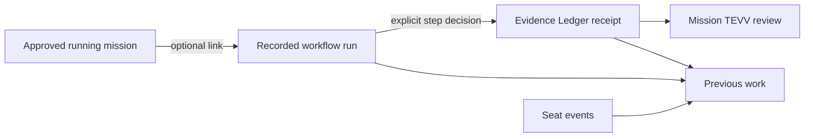

# ─── CGRF Header ───────────────────────────────────────────────
# File:        docs/workspace-integration.md
# Stage:       06_PLAN
# SRS:         SRS-BUILDANDDO-UPGRADE-001
# CAPS:        pending
# CK:          pending
# Dispatch:    VCC-BUILDANDDO-UPGRADE-001
# Seat:        BITS-CODEGEN
# Owner:       Citadel Nexus Inc.
# Created:     2026-09-15
# Depends:     docs/workflow-system.md, apps/pocketbase/pb_migrations/1789800000_restore_workspace_evidence_access.js, tests/upgrade/workspace-integration.test.mjs, tests/upgrade/work-history.test.mjs
# EnumType:    Doc
# EnumEdges:   DEPENDS_ON docs/workflow-system.md; CONSUMES apps/pocketbase/pb_migrations/1789800000_restore_workspace_evidence_access.js; VERIFIED_BY tests/upgrade/workspace-integration.test.mjs; VERIFIED_BY tests/upgrade/work-history.test.mjs
# DAG Node:    none
# Intent:      Make repaired workspace connections and remaining runtime acceptance explicit so recorded work cannot be mistaken for an activated integration.
# ───────────────────────────────────────────────────────────────

# Workspace connections and acceptance

The integration review after PR 22 found a missing icon import in the shared
workspace layout, omitted workspace/evidence read access for members, and
Previous work panels that consulted only seat events. Those defects can make
an implemented page crash, a teammate's workspace disappear, or saved work
look absent. The source repair addresses these paths; it does not activate a
deployment or private agent.

| Connection | Current source behavior | Runtime requirement |
|---|---|---|
| Account → workspace | Owners and current members can discover their workspaces; management stays owner-only. Switching account/workspace/demo remounts private page state. | Apply the shared-read migration and validate the native membership filter. |
| Mission → workflow run | A run may preserve a running mission's saved approval; starting the run remains an explicit operator action. | Install the mission/workflow migrations and command hooks. |
| Workflow step → evidence | A decision and its mission-linked receipt are saved in one transaction. A retry after an uncertain response reuses the same request key. | Validate native transaction, concurrency and permission behavior. |
| Evidence → mission review | Current members can read other members' observations. Only the author with current write authority can change evidence. Review still checks the same mission/workspace and four TEVV observations. | Deploy the new evidence request hooks with the shared-read migration. |
| Evidence/runs → Previous work | Single and batch readers include receipts as well as seat events. Failed/truncated reads are marked incomplete. Successful local writes refresh their history. | Execute the component tests against a configured backend. These summaries are bounded reads, not a realtime feed. |
| ERP → tasks/content | Saved tasks and drafts can reference workspace objectives; publication is an operator-recorded receipt. | Apply the business schema/hooks. No external scheduler or publishing connector is implemented here. |
| Tutorials → learning progress | Public starter lessons are readable; saving progress requires a persisted lesson and signed-in account. | Install the bundled curriculum migration and its data directory. |
| Agent/service → automated execution | The private runtime, ingress, service credentials and external executors remain outside this application. | Complete the existing private delivery/runtime handoffs. A planned service card is not a connection. |



A completed recorded run leaves its mission awaiting a separate review. The
history UI preserves the distinction between a seat's coordination state and
an operator-recorded run outcome. It never derives a seat-completed event from
an evidence record or a workflow status.

## Source verification

```bash
node --test tests/upgrade/*.test.mjs
python -m unittest discover -s tests/upgrade -p 'test_*.py'
node .bits/out/VCC-BUILDANDDO-UPGRADE-001/check-source.cjs
npm --prefix apps/web test -- src/components/workspace/__tests__/PageBoundary.test.jsx src/components/workspace/__tests__/WorkspaceHistory.test.jsx src/components/workspace/workflows/__tests__/WorkflowRuns.test.jsx src/hooks/__tests__/useWorkspaceRecords.test.js
npm --prefix apps/web run test:coverage
npm --prefix apps/web run lint
npm --prefix apps/web run build
```

The Node integration case connects the actual browser command adapter, server
command implementation, transactional storage double and history readers. It
loses the first start and decision responses after persistence, retries them,
and checks that one run and one evidence receipt reach both histories without
verifying the mission. Storage and SDK doubles do not establish native runtime
acceptance. Frontend packages and native PocketBase were absent in this sandbox.

The limited offline diagnostic now checks JSX component bindings as well as
ordinary JavaScript bindings. Core ESLint `no-undef` alone missed the layout's
unimported `Plus` component. The diagnostic still cannot replace React execution,
the production build, repository lint, or browser acceptance.

## Native and browser acceptance before activation

Use an isolated PocketBase 0.28.4 acceptance environment and its existing test
account procedure. Apply the complete migration sequence with the new evidence
hooks. The public sandbox did not mutate a shared backend.

1. Give one workspace an owner, editor and viewer. Give a second workspace an
   unrelated owner/member. Through the native records API, verify that the first
   workspace is discoverable by its three accounts and unavailable to anonymous
   and unrelated accounts. Remove a membership and verify access disappears.
2. Save evidence as the editor, linked to a readable mission in that workspace.
   Verify owner/editor/viewer reads and reject other-workspace reads. Reject
   viewer writes, changes to someone else's authorship, workspace reassignment,
   and links to foreign/unreadable missions. Removing the editor's membership
   must revoke its access even though it authored an old receipt.
3. Start and finish a recorded workflow linked to the mission. Verify native
   evidence/run atomicity and retries, then open the Mission Desk and Evidence
   Ledger as another member. Read access must not grant authority to overwrite
   someone else's evidence or manage the workspace.
4. Open the real workspace layout and navigate its pages. Save a workflow run
   and a mission observation, then verify Previous work updates without a page
   reload. Simulate an unavailable source and verify incomplete history plus
   retry, rather than an absent panel. Test parallel reads of the same collection.
5. Switch workspace/account/demo while a history read or draft is pending. The
   old records and draft must disappear. Check keyboard operation and 320/375/
   1280 px layouts in both themes. A member's unreadable domain details must be
   shown as unavailable, not as proof that the workspace has no website.
6. Verify the accepted build and served version using the existing delivery
   handoff. A successful source merge or health response alone is not evidence
   that these migrations/hooks or the current frontend are running.

## Migration and rollback

`1789800000_restore_workspace_evidence_access.js` changes only list/view rules
on workspaces and evidence. Membership is bound through each workspace's back
relation. Existing create/update/delete rules, fields, IDs and records remain
intact. The evidence request policy additionally requires current write authority
and preserves the original author/workspace and readable mission relationship.

The migration refuses custom read rules before changing either collection;
private customizations require review in the receiving environment. Reapplying
up or down is safe. Down restores the original owner-only reads without deleting
records. Restore those restrictive reads before removing the evidence request
hooks. An ordinary frontend rollback can retain the additive source and stored
receipts. No automatic rollback of unrelated migrations is included.
